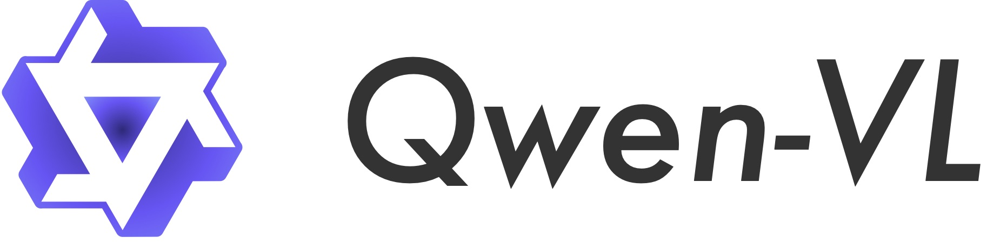
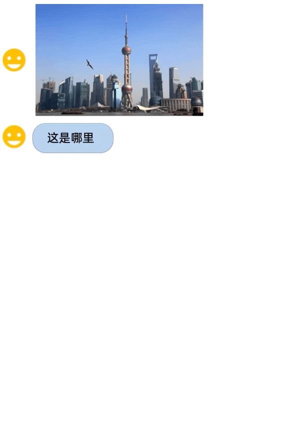
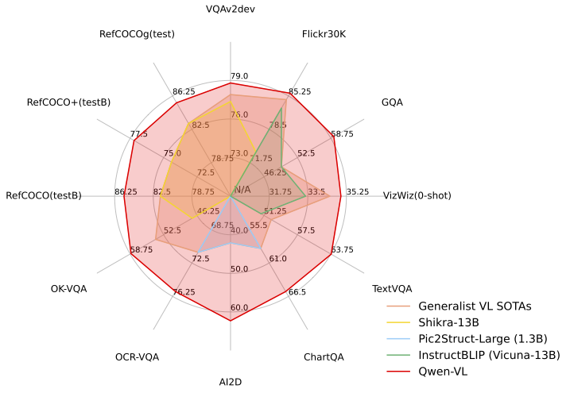
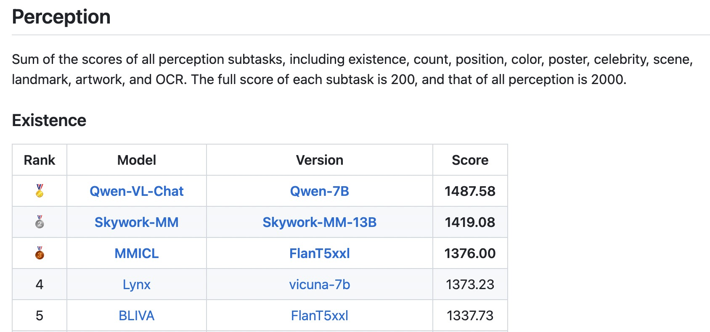
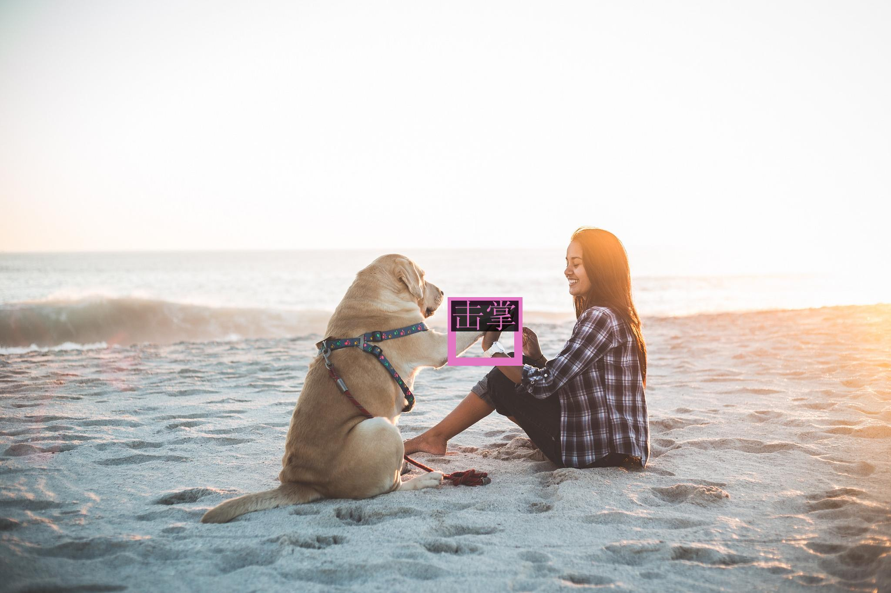
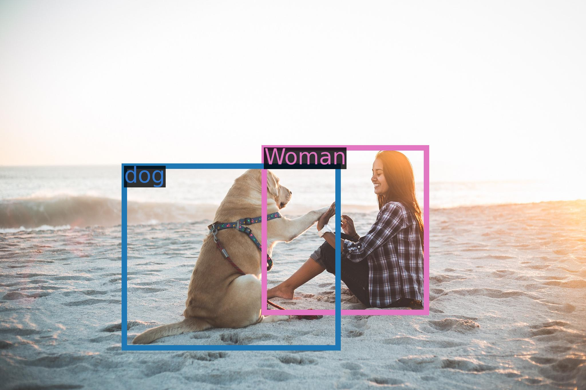

<p align="left">
        <a href="README_CN.md">中文</a>&nbsp ｜ &nbspEnglish&nbsp&nbsp ｜ &nbsp<a href="README_JA.md">日本語</a>&nbsp ｜ &nbsp<a href="README_KO.md">한국어</a>&nbsp
</p>
<br><br>

<p align="center">
    
<p>
<br>

<p align="center">
        Qwen-VL <a href="https://modelscope.cn/models/qwen/Qwen-VL/summary">🤖 <a> | <a href="https://huggingface.co/Qwen/Qwen-VL">🤗</a>&nbsp ｜ Qwen-VL-Chat <a href="https://modelscope.cn/models/qwen/Qwen-VL-Chat/summary">🤖 <a>| <a href="https://huggingface.co/Qwen/Qwen-VL-Chat">🤗</a>&nbsp ｜ Qwen-VL-Chat-Int4 <a href="https://huggingface.co/Qwen/Qwen-VL-Chat-Int4">🤗</a>
<br>
<a href="https://qianwen-res.oss-cn-beijing.aliyuncs.com/qwen_wechat_group.PNG">WeChat</a>&nbsp&nbsp | &nbsp&nbsp<a href="https://discord.gg/z3GAxXZ9Ce">Discord</a>&nbsp&nbsp | &nbsp&nbsp<a href="https://modelscope.cn/studios/qwen/Qwen-VL-Chat-Demo/summary">Demo</a>&nbsp ｜ &nbsp<a href="https://arxiv.org/abs/2308.12966">Paper</a>&nbsp&nbsp | &nbsp&nbsp<a href="https://github.com/camenduru/Qwen-VL-Chat-colab">Colab</a>&nbsp&nbsp | &nbsp <a href="TUTORIAL.md">Tutorial</a>
</p>
<br><br>

---


**Qwen-VL**(Qwen Large Vision Language Model)은 알리바바 클라우드가 제안한 큰 모델 시리즈인 Qwen(약칭, Tongyi Qianwen)의 멀티모달 버전입니다. Qwen-VL은 이미지, 텍스트, 그리고 바운딩 박스를 입력으로 받아 텍스트와 바운딩 박스를 출력합니다. Qwen-VL의 특징은 다음과 같습니다.

- **강력한 성능**: 동일한 모델 규모의 기존 공개된 대규모 시각 언어 모델(Large Vision Language Models, ㄴLVLM)보다 영어 평가 벤치마크(Zero-shot Captioning, VQA, DocVQA, Grounding 포함)에서 현저히 우수합니다.
- **텍스트 인식을 지원하는 다국어 LVLM**: Qwen-VL은 자연스러운 영어, 중국어 및 다국어 대화를 지원하며, 이미지 내 중국어-영어 간 이중 언어 텍스트의 종단 간 인식을 개선했습니다.
- **다중 이미지 교차 대화**: 이 기능은 여러 이미지의 입력과 비교뿐만 아니라 이미지와 관련된 질문을 지정하고 다중 이미지 스토리텔링에 참여할 수 있는 기능을 제공합니다.
- **중국어에서 지상화를 지원하는 첫 번째 일반 모델**: 중국어와 영어의 개방형 언어 표현을 통해 바운딩 박스를 인식합니다.
- **세밀한 인식 및 이해**: 다른 공개된 LVLM이 현재 사용하는 224\*224 해상도와 비교하여 448\*448 해상도는 세밀한 텍스트 인식, 문서 QA 및 바운딩 어노테이션을 개선했습니다.

<br>
<p align="center">
    
<p>
<br>

Qwen-VL 시리즈의 두 모델을 출시합니다.

- Qwen-VL: 사전 훈련된 LVLM 모델로, Qwen-7B를 LLM의 초기화에 사용하며, 시각 인코더의 초기화로는 [Openclip ViT-bigG](https://github.com/mlfoundations/open_clip)를 사용하여, 무작위로 초기화된 교차 어텐션 레이어(randomly initialized cross-attention layer)에 연결합니다.
- Qwen-VL-Chat: 정렬 기술로 훈련된 멀티모달 LLM 기반 AI 어시스턴트입니다. Qwen-VL-Chat은 여러 이미지 입력, 다중 라운드 질문 응답, 창의적 능력과 같은 더 유연한 상호작용을 지원합니다.

<br>

## 뉴스 및 업데이트
* ```2023.9.25``` 🚀🚀🚀 Qwen-VL-Chat을 더욱 강력한 중국어 지시 수행 능력, 웹페이지 및 표 이미지에 대한 개선된 이해력, 더 나은 대화 성능(TouchStone: CN: 401.2->481.7, EN: 645.2->711.6)으로 업데이트 되었습니다.
* ```2023.9.12``` 😃😃😃 이제 Qwen-VL 모델에 대한 파인튜닝을 지원합니다. 이에는 전체 파라미터 파인튜닝, LoRA 및 Q-LoRA가 포함됩니다.
* ```2023.9.8``` 👍👍👍 camenduru가 멋진 Colab을 기여해 주셔서 감사합니다. 모두가 12G GPU에서 로컬 또는 온라인 Qwen-VL-Chat-Int4 데모 튜토리얼로 사용할 수 있습니다.
* ```2023.9.5``` 👏👏👏 Qwen-VL-Chat은 MME Benchmark, 멀티모달 대형 언어 모델을 위한 종합적인 평가 벤치마크에서 SOTAs를 달성했습니다. 이는 총 14개의 하위 과제에서 인식과 인지 능력을 모두 측정합니다.
* ```2023.9.4``` ⭐⭐⭐ Qwen-VL 시리즈는 Seed-Bench, 이미지 및 비디오 이해를 평가하는 19K 다중 선택 질문의 멀티모달 벤치마크에서 SOTAs를 달성했습니다. 이는 정확한 인간 주석을 갖추고 있습니다.
* ```2023.9.1``` 🔥🔥🔥 기본적인 인식과 이해력뿐만 아니라 문학 창작까지 아우르는 복합 언어 모델에 대한 종합적인 평가인 [TouchStone](https://github.com/OFA-Sys/TouchStone) 평가를 출시합니다. 강력한 LLM을 심사위원으로 활용하고, 멀티모달 정보를 텍스트로 변환하여 평가합니다.
* ```2023.8.31``` 🌟🌟🌟 Qwen-VL-Chat용 Int4 양자화 모델인 **Qwen-VL-Chat-Int4**를 출시하여 메모리 비용은 낮추고 추론 속도는 향상시켰습니다. 또한 벤치마크 평가에서도 성능 저하가 크지 않습니다.
* ```2023.8.22``` 🎉🎉🎉 모델스코프와 허깅페이스에 **Qwen-VL**과 **Qwen-VL-Chat**을 모두 출시합니다. 학습 내용 및 모델 성능 등 모델에 대한 자세한 내용은 [논문](https://arxiv.org/abs/2308.12966)을 통해 확인할 수 있습니다.


## Evaluation

세 가지 관점에서 모델의 기능을 평가했습니다:

1. **표준 벤치마크**: 멀티모달 작업의 네 가지 주요 범주에 대한 모델의 기본 작업 기능을 평가합니다:
   
   - 제로 샷 캡션: 보이지 않는 데이터 세트에 대한 모델의 제로샷 이미지 캡션 능력을 평가합니다.
   - 일반 VQA: 판단, 색상, 숫자, 카테고리 등과 같은 사진의 일반적인 질문에 대한 답변 능력을 평가합니다.
   - 텍스트 기반 VQA: 문서 QA, 차트 QA 등과 같이 사진 속 텍스트를 인식하는 모델의 능력을 평가합니다.
   - 참조 표현 이해: 참조 표현식으로 설명된 이미지에서 대상 객체를 찾아내는 능력을 평가합니다.
  
2. **터치스톤**: 전반적인 텍스트-이미지 대화 능력과 사람과의 일치도를 평가하기 위해 [TouchStone](https://github.com/OFA-Sys/TouchStone)이라는 벤치마크를 구축했으며, 이 벤치마크는 GPT4로 채점하여 LVLM 모델을 평가합니다.
   
   - 터치스톤 벤치마크는 총 300개 이상의 이미지, 800개 이상의 질문, 27개 카테고리를 다룹니다. 속성 기반 Q&A, 유명인 인식, 시 쓰기, 여러 이미지 요약, 제품 비교, 수학 문제 풀이 등이 포함됩니다.
   - 직접 이미지 입력이라는 현재 GPT4의 한계를 극복하기 위해 TouchStone은 사람이 직접 라벨을 지정하여 세분화된 이미지 주석을 제공합니다. 이러한 세부 주석은 문제 및 모델의 출력과 함께 채점을 위해 GPT4에 제공됩니다.
   - 벤치마크에는 영어와 중국어 버전이 모두 포함되어 있습니다.
  
3. **기타 멀티모달 벤치마크**: 다른 멀티모달 벤치마크에서도 모델의 성능을 평가했습니다:

   - 멀티모달 대규모 언어 모델에 대한 종합적인 평가 벤치마크인 [MME 벤치마크](https://github.com/BradyFU/Awesome-Multimodal-Large-Language-Models/tree/Evaluation). Qwen-VL-Chat은 지각과 인지 트랙 모두에서 SOTA를 달성했습니다.
   - [Seed-Bench](https://huggingface.co/spaces/AILab-CVC/SEED-Bench_Leaderboard)는 멀티모달 LLM을 평가하기 위한 정확한 인간 주석이 포함된 19K 객관식 질문으로 구성된 멀티모달 벤치마크입니다. 큐원 시리즈는 이 벤치마크에서 SOTA를 달성했습니다.

평가 결과는 다음과 같습니다.

Qwen-VL은 여러 VL 작업에서 현재 SOTA 제너럴리스트 모델보다 성능이 뛰어나며, 기능 범위 측면에서 더 포괄적인 기능을 지원합니다.

<p align="center">
    
<p>

### Zero-shot Captioning & General VQA

<table>
<thead>
  <tr>
    <th rowspan="2">Model type</th>
    <th rowspan="2">Model</th>
    <th colspan="2">Zero-shot Captioning</th>
    <th colspan="5">General VQA</th>
  </tr>
  <tr>
    <th>NoCaps</th>
    <th>Flickr30K</th>
    <th>VQAv2<sup>dev</sup></th>
    <th>OK-VQA</th>
    <th>GQA</th>
    <th>SciQA-Img<br>(0-shot)</th>
    <th>VizWiz<br>(0-shot)</th>
  </tr>
</thead>
<tbody align="center">
  <tr>
    <td rowspan="10">Generalist<br>Models</td>
    <td>Flamingo-9B</td>
    <td>-</td>
    <td>61.5</td>
    <td>51.8</td>
    <td>44.7</td>
    <td>-</td>
    <td>-</td>
    <td>28.8</td>
  </tr>
  <tr>
    <td>Flamingo-80B</td>
    <td>-</td>
    <td>67.2</td>
    <td>56.3</td>
    <td>50.6</td>
    <td>-</td>
    <td>-</td>
    <td>31.6</td>
  </tr>
  <tr>
    <td>Unified-IO-XL</td>
    <td>100.0</td>
    <td>-</td>
    <td>77.9</td>
    <td>54.0</td>
    <td>-</td>
    <td>-</td>
    <td>-</td>
  </tr>
  <tr>
    <td>Kosmos-1</td>
    <td>-</td>
    <td>67.1</td>
    <td>51.0</td>
    <td>-</td>
    <td>-</td>
    <td>-</td>
    <td>29.2</td>
  </tr>
  <tr>
    <td>Kosmos-2</td>
    <td>-</td>
    <td>80.5</td>
    <td>51.1</td>
    <td>-</td>
    <td>-</td>
    <td>-</td>
    <td>-</td>
  </tr>
  <tr>
    <td>BLIP-2 (Vicuna-13B)</td>
    <td>103.9</td>
    <td>71.6</td>
    <td>65.0</td>
    <td>45.9</td>
    <td>32.3</td>
    <td>61.0</td>
    <td>19.6</td>
  </tr>
  <tr>
    <td>InstructBLIP (Vicuna-13B)</td>
    <td><strong>121.9</strong></td>
    <td>82.8</td>
    <td>-</td>
    <td>-</td>
    <td>49.5</td>
    <td>63.1</td>
    <td>33.4</td>
  </tr>
  <tr>
    <td>Shikra (Vicuna-13B)</td>
    <td>-</td>
    <td>73.9</td>
    <td>77.36</td>
    <td>47.16</td>
    <td>-</td>
    <td>-</td>
    <td>-</td>
  </tr>
  <tr>
    <td><strong>Qwen-VL (Qwen-7B)</strong></td>
    <td>121.4</td>
    <td><b>85.8</b></td>
    <td><b>78.8</b></td>
    <td><b>58.6</b></td>
    <td><b>59.3</b></td>
    <td>67.1</td>
    <td>35.2</td>
  </tr>
  <!-- <tr>
    <td>Qwen-VL (4-shot)</td>
    <td>-</td>
    <td>-</td>
    <td>-</td>
    <td>63.6</td>
    <td>-</td>
    <td>-</td>
    <td>39.1</td>
  </tr> -->
  <tr>
    <td>Qwen-VL-Chat</td>
    <td>120.2</td>
    <td>81.0</td>
    <td>78.2</td>
    <td>56.6</td>
    <td>57.5</td>
    <td><b>68.2</b></td>
    <td><b>38.9</b></td>
  </tr>
  <!-- <tr>
    <td>Qwen-VL-Chat (4-shot)</td>
    <td>-</td>
    <td>-</td>
    <td>-</td>
    <td>60.6</td>
    <td>-</td>
    <td>-</td>
    <td>44.45</td>
  </tr> -->
  <tr>
    <td>Previous SOTA<br>(Per Task Fine-tuning)</td>
    <td>-</td>
    <td>127.0<br>(PALI-17B)</td>
    <td>84.5<br>(InstructBLIP<br>-FlanT5-XL)</td>
    <td>86.1<br>(PALI-X<br>-55B)</td>
    <td>66.1<br>(PALI-X<br>-55B)</td>
    <td>72.1<br>(CFR)</td>
    <td>92.53<br>(LLaVa+<br>GPT-4)</td>
    <td>70.9<br>(PALI-X<br>-55B)</td>
  </tr>
</tbody>
</table>

- 제로 샷 이미지 캡션의 경우, Qwen-VL은 Flickr30K에서 **SOTA**를 달성했고 InstructBlip을 사용하여 노캡스에서 경쟁력 있는 결과를 얻었습니다.
- 일반 VQA의 경우, Qwen-VL은 동일한 일반 LVLM 스케일 설정에서 **SOTA**를 달성했습니다.


### Text-oriented VQA (Focused on text understanding capabilities in images)

<table>
<thead>
  <tr>
    <th>Model type</th>
    <th>Model</th>
    <th>TextVQA</th>
    <th>DocVQA</th>
    <th>ChartQA</th>
    <th>AI2D</th>
    <th>OCR-VQA</th>
  </tr>
</thead>
<tbody align="center">
  <tr>
    <td rowspan="5">Generalist Models</td>
    <td>BLIP-2 (Vicuna-13B)</td>
    <td>42.4</td>
    <td>-</td>
    <td>-</td>
    <td>-</td>
    <td>-</td>
  </tr>
  <tr>
    <td>InstructBLIP (Vicuna-13B)</td>
    <td>50.7</td>
    <td>-</td>
    <td>-</td>
    <td>-</td>
    <td>-</td>
  </tr>
  <tr>
    <td>mPLUG-DocOwl (LLaMA-7B)</td>
    <td>52.6</td>
    <td>62.2</td>
    <td>57.4</td>
    <td>-</td>
    <td>-</td>
  </tr>
  <tr>
    <td>Pix2Struct-Large (1.3B)</td>
    <td>-</td>
    <td><b>76.6</b></td>
    <td>58.6</td>
    <td>42.1</td>
    <td>71.3</td>
  </tr>
  <tr>
    <td>Qwen-VL (Qwen-7B)</td>
    <td><b>63.8</b></td>
    <td>65.1</td>
    <td><b>65.7</b></td>
    <td><b>62.3</b></td>
    <td><b>75.7</b></td>
  </tr>
  <tr>
    <td>Specialist SOTAs<br>(Specialist/Finetuned)</td>
    <td>PALI-X-55B (Single-task FT)<br>(Without OCR Pipeline)</td>
    <td>71.44</td>
    <td>80.0</td>
    <td>70.0</td>
    <td>81.2</td>
    <td>75.0</td>
  </tr>
</tbody>
</table>

- 텍스트 관련 인식/QA 평가에서 Qwen-VL은 일반적인 LVLM 스케일 설정에서 SOTA를 달성합니다.
- 해상도는 위의 여러 평가에서 중요합니다. 224 해상도의 대부분의 오픈 소스 LVLM 모델은 이러한 평가를 수행할 수 없거나 이미지를 잘라내야만 해결할 수 있지만, Qwen-VL은 해상도를 448로 확장하여 엔드투엔드 평가가 가능합니다. Qwen-VL은 일부 작업에서 1024 해상도의 Pix2Struct-Large 모델보다 더 뛰어난 성능을 발휘합니다.

### Referring Expression Comprehension

<table>
<thead>
  <tr>
    <th rowspan="2">Model type</th>
    <th rowspan="2">Model</th>
    <th colspan="3">RefCOCO</th>
    <th colspan="3">RefCOCO+</th>
    <th colspan="2">RefCOCOg</th>
    <th>GRIT</th>
  </tr>
  <tr>
    <th>val</th>
    <th>test-A</th>
    <th>test-B</th>
    <th>val</th>
    <th>test-A</th>
    <th>test-B</th>
    <th>val-u</th>
    <th>test-u</th>
    <th>refexp</th>
  </tr>
</thead>
<tbody align="center">
  <tr>
    <td rowspan="8">Generalist Models</td>
    <td>GPV-2</td>
    <td>-</td>
    <td>-</td>
    <td>-</td>
    <td>-</td>
    <td>-</td>
    <td>-</td>
    <td>-</td>
    <td>-</td>
    <td>51.50</td>
  </tr>
  <tr>
    <td>OFA-L*</td>
    <td>79.96</td>
    <td>83.67</td>
    <td>76.39</td>
    <td>68.29</td>
    <td>76.00</td>
    <td>61.75</td>
    <td>67.57</td>
    <td>67.58</td>
    <td>61.70</td>
  </tr>
  <tr>
    <td>Unified-IO</td>
    <td>-</td>
    <td>-</td>
    <td>-</td>
    <td>-</td>
    <td>-</td>
    <td>-</td>
    <td>-</td>
    <td>-</td>
    <td><b>78.61</b></td>
  </tr>
  <tr>
    <td>VisionLLM-H</td>
    <td></td>
    <td>86.70</td>
    <td>-</td>
    <td>-</td>
    <td>-</td>
    <td>-</td>
    <td>-</td>
    <td>-</td>
    <td>-</td>
  </tr>
  <tr>
    <td>Shikra-7B</td>
    <td>87.01</td>
    <td>90.61</td>
    <td>80.24 </td>
    <td>81.60</td>
    <td>87.36</td>
    <td>72.12</td>
    <td>82.27</td>
    <td>82.19</td>
    <td>69.34</td>
  </tr>
  <tr>
    <td>Shikra-13B</td>
    <td>87.83 </td>
    <td>91.11</td>
    <td>81.81</td>
    <td>82.89</td>
    <td>87.79</td>
    <td>74.41</td>
    <td>82.64</td>
    <td>83.16</td>
    <td>69.03</td>
  </tr>
  <tr>
    <td>Qwen-VL-7B</td>
    <td><b>89.36</b></td>
    <td>92.26</td>
    <td><b>85.34</b></td>
    <td><b>83.12</b></td>
    <td>88.25</td>
    <td><b>77.21</b></td>
    <td>85.58</td>
    <td>85.48</td>
    <td>78.22</td>
  </tr>
  <tr>
    <td>Qwen-VL-7B-Chat</td>
    <td>88.55</td>
    <td><b>92.27</b></td>
    <td>84.51</td>
    <td>82.82</td>
    <td><b>88.59</b></td>
    <td>76.79</td>
    <td><b>85.96</b></td>
    <td><b>86.32</b></td>
    <td>-</td>
  <tr>
    <td rowspan="3">Specialist SOTAs<br>(Specialist/Finetuned)</td>
    <td>G-DINO-L</td>
    <td>90.56</td>
    <td>93.19</td>
    <td>88.24</td>
    <td>82.75</td>
    <td>88.95</td>
    <td>75.92</td>
    <td>86.13</td>
    <td>87.02</td>
    <td>-</td>
  </tr>
  <tr>
    <td>UNINEXT-H</td>
    <td>92.64 </td>
    <td>94.33</td>
    <td>91.46</td>
    <td>85.24</td>
    <td>89.63</td>
    <td>79.79</td>
    <td>88.73</td>
    <td>89.37</td>
    <td>-</td>
  </tr>
  <tr>
    <td>ONE-PEACE</td>
    <td>92.58 </td>
    <td>94.18</td>
    <td>89.26</td>
    <td>88.77</td>
    <td>92.21</td>
    <td>83.23</td>
    <td>89.22</td>
    <td>89.27</td>
    <td>-</td>
  </tr>
</tbody>
</table>

- Qwen-VL은 위의 모든 참조 표현 이해도 벤치마크에서 **SOTA**를 달성했습니다.
- Qwen-VL은 중국어 자막 데이터에 대해 학습되지 않았지만, 중국어 자막 데이터와 영어 자막 데이터를 학습하여 제로 샷 방식으로 중국어 자막 작업에 일반화할 수 있습니다.


실험 결과를 재현하기 위해 위의 모든 평가 스크립트를 제공합니다. 자세한 내용은 [eval_mm/EVALUATION.md](eval_mm/EVALUATION.md)를 참조하세요.

### Chat evaluation

TouchStone은 텍스트-이미지 대화 및 사람과의 일치 수준에 대한 LVLM 모델의 능력을 평가하기 위해 GPT4로 점수를 매기는 벤치마크입니다. 총 300개 이상의 이미지, 800개 이상의 질문, 속성 기반 Q&A, 유명인 인식, 시 쓰기, 여러 이미지 요약, 제품 비교, 수학 문제 풀이 등 27개 카테고리로 구성되어 있습니다. 자세한 내용은 [터치스톤/README.md](터치스톤/README.md)를 참조하세요.

#### English evaluation

| Model            | Score |
| ---------------- | ----- |
| PandaGPT         | 488.5 |
| MiniGPT4         | 531.7 |
| InstructBLIP     | 552.4 |
| LLaMA-AdapterV2  | 590.1 |
| LLaVA            | 602.7 |
| mPLUG-Owl        | 605.4 |
| Qwen-VL-Chat     | 645.2 |
| Qwen-VL-Chat-1.1 | 711.6 |

#### Chinese evaluation

| Model            | Score |
| ---------------- | ----- |
| VisualGLM        | 247.1 |
| Qwen-VL-Chat     | 401.2 |
| Qwen-VL-Chat-1.1 | 481.7 |

Qwen-VL-Chat은 중국어와 영어 정렬 평가에서 모두 최고의 결과를 얻었습니다.

### Other Benchmarks

#### MME Benchmark

[MME](https://github.com/BradyFU/Awesome-Multimodal-Large-Language-Models/tree/Evaluation)는 멀티모달 대규모 언어 모델에 대한 종합적인 평가 벤치마크입니다. 존재, 수, 위치, 색상, 포스터, 유명인, 장면, 랜드마크, 예술품, OCR, 상식 추론, 숫자 계산, 텍스트 번역, 코드 추론 등 총 14개의 하위 과제에 대한 지각과 인지 능력을 모두 측정합니다.

Qwen-VL-Chat은 지각과 인지 평가 모두에서 SOTA를 달성했습니다. 자세한 내용은 [여기](eval_mm/mme/EVAL_MME.md)에서 확인하세요.

<p align="center">
    
<p>
<p align="center">
    
<p>

#### SEED-Bench

[SEED-Bench](https://huggingface.co/spaces/AILab-CVC/SEED-Bench_Leaderboard)는 **이미지** 및 **동영상** 이해도를 포함한 12가지 평가 차원을 포괄하는 멀티모달 LLM을 평가하기 위한 정확한 사람의 주석이 포함된 19K 개의 객관식 문항으로 구성된 멀티모달 벤치마크입니다. 자세한 내용은 [여기](eval_mm/seed_bench/EVAL_SEED.md)에서 확인할 수 있습니다.

이 벤치마크에서 Qwen-VL과 Qwen-VL-Chat은 SOTA를 달성했습니다.

<p align="center">
    
<p>

## Requirements

* python 3.8 and above
* pytorch 1.12 and above, 2.0 and above are recommended
* CUDA 11.4 and above are recommended (this is for GPU users)
  <br>

## Quickstart

아래에서는 🤖 모델스코프 및 🤗 트랜스포머와 함께 Qwen-VL 및 Qwen-VL-Chat을 사용하는 방법을 보여주는 간단한 예제를 제공합니다.

코드를 실행하기 전에 환경을 설정하고 필요한 패키지를 설치했는지 확인하세요. 위의 요구 사항을 충족하는지 확인한 다음 종속 라이브러리를 설치하세요.
```bash
pip install -r requirements.txt
```

이제 모델스코프 또는 트랜스포머로 시작할 수 있습니다. 비전 인코더에 대한 자세한 사용법은 [튜토리얼](TUTORIAL.md)을 참조하세요.

#### 🤗 Transformers

추론에 Qwen-VL-Chat을 사용하려면 아래에 설명된 대로 몇 줄의 코드를 입력하기만 하면 됩니다. 단, **최신 코드를 사용하고 있는지 확인하세요**.

```python
from transformers import AutoModelForCausalLM, AutoTokenizer
from transformers.generation import GenerationConfig
import torch
torch.manual_seed(1234)

# Note: The default behavior now has injection attack prevention off.
tokenizer = AutoTokenizer.from_pretrained("Qwen/Qwen-VL-Chat", trust_remote_code=True)

# use bf16
# model = AutoModelForCausalLM.from_pretrained("Qwen/Qwen-VL-Chat", device_map="auto", trust_remote_code=True, bf16=True).eval()
# use fp16
# model = AutoModelForCausalLM.from_pretrained("Qwen/Qwen-VL-Chat", device_map="auto", trust_remote_code=True, fp16=True).eval()
# use cpu only
# model = AutoModelForCausalLM.from_pretrained("Qwen/Qwen-VL-Chat", device_map="cpu", trust_remote_code=True).eval()
# use cuda device
model = AutoModelForCausalLM.from_pretrained("Qwen/Qwen-VL-Chat", device_map="cuda", trust_remote_code=True).eval()

# Specify hyperparameters for generation
model.generation_config = GenerationConfig.from_pretrained("Qwen/Qwen-VL-Chat", trust_remote_code=True)

# 1st dialogue turn
query = tokenizer.from_list_format([
    {'image': 'https://qianwen-res.oss-cn-beijing.aliyuncs.com/Qwen-VL/assets/demo.jpeg'}, # Either a local path or an url
    {'text': '这是什么?'},
])
response, history = model.chat(tokenizer, query=query, history=None)
print(response)
# 图中是一名女子在沙滩上和狗玩耍，旁边是一只拉布拉多犬，它们处于沙滩上。

# 2nd dialogue turn
response, history = model.chat(tokenizer, '框出图中击掌的位置', history=history)
print(response)
# <ref>击掌</ref><box>(536,509),(588,602)</box>
image = tokenizer.draw_bbox_on_latest_picture(response, history)
if image:
  image.save('1.jpg')
else:
  print("no box")
```

<p align="center">
    
<p>

<details>
  <summary>Running Qwen-VL</summary>

Qwen-VL pretrained base model을 실행하는 것도 매우 간단합니다.

```python
from transformers import AutoModelForCausalLM, AutoTokenizer
from transformers.generation import GenerationConfig
import torch
torch.manual_seed(1234)

tokenizer = AutoTokenizer.from_pretrained("Qwen/Qwen-VL", trust_remote_code=True)

# use bf16
# model = AutoModelForCausalLM.from_pretrained("Qwen/Qwen-VL", device_map="auto", trust_remote_code=True, bf16=True).eval()
# use fp16
# model = AutoModelForCausalLM.from_pretrained("Qwen/Qwen-VL", device_map="auto", trust_remote_code=True, fp16=True).eval()
# use cpu only
# model = AutoModelForCausalLM.from_pretrained("Qwen/Qwen-VL", device_map="cpu", trust_remote_code=True).eval()
# use cuda device
model = AutoModelForCausalLM.from_pretrained("Qwen/Qwen-VL", device_map="cuda", trust_remote_code=True).eval()

# Specify hyperparameters for generation (No need to do this if you are using transformers>4.32.0)
# model.generation_config = GenerationConfig.from_pretrained("Qwen/Qwen-VL", trust_remote_code=True)

query = tokenizer.from_list_format([
    {'image': 'https://qianwen-res.oss-cn-beijing.aliyuncs.com/Qwen-VL/assets/demo.jpeg'}, # Either a local path or an url
    {'text': 'Generate the caption in English with grounding:'},
])
inputs = tokenizer(query, return_tensors='pt')
inputs = inputs.to(model.device)
pred = model.generate(**inputs)
response = tokenizer.decode(pred.cpu()[0], skip_special_tokens=False)
print(response)
# https://qianwen-res.oss-cn-beijing.aliyuncs.com/Qwen-VL/assets/demo.jpeg</img>Generate the caption in English with grounding:<ref> Woman</ref><box>(451,379),(731,806)</box> and<ref> her dog</ref><box>(219,424),(576,896)</box> playing on the beach<|endoftext|>
image = tokenizer.draw_bbox_on_latest_picture(response)
if image:
  image.save('2.jpg')
else:
  print("no box")
```

<p align="center">
    
<p>

</details>


HuggingFace에서 모델 체크포인트와 코드를 다운로드하는 동안 네트워크 문제가 발생하는 경우, 아래에 설명된 대로 모델스코프에서 체크포인트를 먼저 가져온 다음 로컬 디렉터리에서 로드하는 방법을 사용할 수 있습니다.

```python
from modelscope import snapshot_download
from transformers import AutoModelForCausalLM, AutoTokenizer

# Downloading model checkpoint to a local dir model_dir
# model_dir = snapshot_download('qwen/Qwen-VL')
model_dir = snapshot_download('qwen/Qwen-VL-Chat')


# Loading local checkpoints
# trust_remote_code is still set as True since we still load codes from local dir instead of transformers
tokenizer = AutoTokenizer.from_pretrained(model_dir, trust_remote_code=True)
model = AutoModelForCausalLM.from_pretrained(
    model_dir,
    device_map="cuda",
    trust_remote_code=True
).eval()
```

#### 🤖 ModelScope

ModelScope는 서비스형 모델(MaaS)을 위한 오픈소스 플랫폼으로, AI 개발자에게 유연하고 비용 효율적인 모델 서비스를 제공합니다. 마찬가지로 아래와 같이 ModelScope로 모델을 실행할 수 있습니다.

```python
from modelscope import (
    snapshot_download, AutoModelForCausalLM, AutoTokenizer, GenerationConfig
)
import torch
model_id = 'qwen/Qwen-VL-Chat'
revision = 'v1.0.0'

model_dir = snapshot_download(model_id, revision=revision)
torch.manual_seed(1234)

tokenizer = AutoTokenizer.from_pretrained(model_dir, trust_remote_code=True)
if not hasattr(tokenizer, 'model_dir'):
    tokenizer.model_dir = model_dir
# use bf16
# model = AutoModelForCausalLM.from_pretrained(model_dir, device_map="auto", trust_remote_code=True, bf16=True).eval()
# use fp16
model = AutoModelForCausalLM.from_pretrained(model_dir, device_map="auto", trust_remote_code=True, fp16=True).eval()
# use cpu
# model = AutoModelForCausalLM.from_pretrained(model_dir, device_map="cpu", trust_remote_code=True).eval()
# use auto
model = AutoModelForCausalLM.from_pretrained(model_dir, device_map="auto", trust_remote_code=True).eval()

# Specify hyperparameters for generation (No need to do this if you are using transformers>=4.32.0)
# model.generation_config = GenerationConfig.from_pretrained(model_dir, trust_remote_code=True)

# 1st dialogue turn
# Either a local path or an url between </img> tags.
image_path = 'https://qianwen-res.oss-cn-beijing.aliyuncs.com/Qwen-VL/assets/demo.jpeg'
response, history = model.chat(tokenizer, query=f'{image_path}</img>这是什么', history=None)
print(response)
# 图中是一名年轻女子在沙滩上和她的狗玩耍，狗的品种是拉布拉多。她们坐在沙滩上，狗的前腿抬起来，与人互动。

# 2nd dialogue turn
response, history = model.chat(tokenizer, '输出击掌的检测框', history=history)
print(response)
# <ref>"击掌"</ref><box>(211,412),(577,891)</box>
image = tokenizer.draw_bbox_on_latest_picture(response, history)
if image:
  image.save('output_chat.jpg')
else:
  print("no box")
```

<p align="center">
    
<p>
<br>

## Quantization

### Usage
[AutoGPTQ](https://github.com/PanQiWei/AutoGPTQ)를 기반으로 하는 새로운 솔루션을 제공하고, 거의 무손실 모델 효과를 달성하면서도 메모리 비용과 추론 속도 모두에서 성능이 향상된 Qwen-VL-Chat용 Int4 양자화 모델인 [Qwen-VL-Chat-Int4](https://huggingface.co/Qwen/Qwen-VL-Chat-Int4)를 출시했습니다.

여기에서는 제공된 양자화된 모델을 추론에 사용하는 방법을 보여줍니다. 시작하기 전에 요구 사항(예: torch 2.0 이상, transformers 4.32.0 이상 등) 및 필요한 패키지를 제대로 설치했는지 확인하세요.

```bash
pip install optimum
git clone https://github.com/JustinLin610/AutoGPTQ.git & cd AutoGPTQ
pip install -v .
```

만약 'auto-gptq' 설치에 문제가 있다면, 공식 [repo](https://github.com/PanQiWei/AutoGPTQ)에서 휠을 찾아보시길 권장합니다.

그러면 정량화된 모델을 쉽게 로드하고 평소와 동일하게 추론을 실행할 수 있습니다.

```python
model = AutoModelForCausalLM.from_pretrained(
    "Qwen/Qwen-VL-Chat-Int4",
    device_map="auto",
    trust_remote_code=True
).eval()
# Either a local path or an url between </img> tags.
image_path = 'https://qianwen-res.oss-cn-beijing.aliyuncs.com/Qwen-VL/assets/demo.jpeg'
response, history = model.chat(tokenizer, query=f'{image_path}</img>这是什么', history=None)
print(response)
```

### Performance

 [TouchStone](https://github.com/OFA-Sys/TouchStone)벤치마크에서 BF16 및 Int4 모델의 모델 성능을 살펴본 결과, 양자화된 모델에서 성능 저하가 크지 않은 것으로 나타났습니다. 결과는 아래와 같습니다.

| Quantization | ZH         | EN            |
| ------------ | :--------: | :-----------: | 
| BF16         | 401.2      |    645.2      |
| Int4         | 386.6      |    651.4      |

### Inference Speed

이미지의 컨텍스트(258개의 토큰이 필요한)를 가지고 각각 1792개(2048-258개), 7934개(8192-258개)의 토큰을 생성하는 평균 추론 속도(토큰/초)를 BF16 정밀도와 Int4 양자화 하에서 측정했습니다.

| Quantization | Speed (2048 tokens) | Speed (8192 tokens) |
| ------------ | :-----------------: | :-----------------: |
| BF16         |        28.87        |        24.32        |
| Int4         |        37.79        |        34.34        |

프로파일링은 PyTorch 2.0.1 및 CUDA 11.4가 탑재된 단일 A100-SXM4-80G GPU에서 실행됩니다.

### GPU Memory Usage

또한 1792개(2048-258개)의 토큰(이미지 포함)을 컨텍스트로 인코딩하고 단일 토큰을 생성할 때와 7934개(8192-258개)의 토큰(이미지가 컨텍스트로 포함)을 생성할 때 각각 BF16 또는 Int4 양자화 수준에서 최대 GPU 메모리 사용량을 프로파일링했습니다. 결과는 아래와 같습니다.

| Quantization | Peak Usage for Encoding 2048 Tokens | Peak Usage for Generating 8192 Tokens |
| ------------ | :---------------------------------: | :-----------------------------------: |
| BF16         |               22.60GB               |                28.01GB                |
| Int4         |               11.82GB               |                17.23GB                |

위의 속도 및 메모리 프로파일링은 [이 스크립트](https://qianwen-res.oss-cn-beijing.aliyuncs.com/profile_mm.py)를 사용하여 수행되었습니다.
<br>

## Finetuning

이제 사용자가 다운스트림 애플리케이션을 위해 사전 학습된 모델을 간단한 방식으로 미세 조정할 수 있도록 공식 학습 스크립트인 `finetune.py`를 제공합니다. 또한, 걱정 없이 미세 조정을 시작할 수 있는 셸 스크립트도 제공합니다. 이 스크립트는 딥스피드와 FSDP를 통한 학습을 지원합니다. 제공되는 셸 스크립트는 DeepSpeed를 사용하므로 시작하기 전에 DeepSpeed를 설치하는 것이 좋습니다.

```bash
pip install deepspeed
```

### Data preparation
학습 데이터를 준비하려면 모든 샘플을 목록에 넣고 json 파일에 저장해야 합니다. 각 샘플은 ID와 대화 목록으로 구성된 사전입니다. 아래는 샘플 1개가 포함된 간단한 예제 목록입니다.
```json
[
  {
    "id": "identity_0",
    "conversations": [
      {
        "from": "user",
        "value": "你好"
      },
      {
        "from": "assistant",
        "value": "我是Qwen-VL,一个支持视觉输入的大模型。"
      }
    ]
  },
  {
    "id": "identity_1",
    "conversations": [
      {
        "from": "user",
        "value": "Picture 1: https://qianwen-res.oss-cn-beijing.aliyuncs.com/Qwen-VL/assets/demo.jpeg</img>\n图中的狗是什么品种？"
      },
      {
        "from": "assistant",
        "value": "图中是一只拉布拉多犬。"
      },
      {
        "from": "user",
        "value": "框出图中的格子衬衫"
      },
      {
        "from": "assistant",
        "value": "<ref>格子衬衫</ref><box>(588,499),(725,789)</box>"
      }
    ]
  },
  { 
    "id": "identity_2",
    "conversations": [
      {
        "from": "user",
        "value": "Picture 1: assets/mm_tutorial/Chongqing.jpeg</img>\nPicture 2: assets/mm_tutorial/Beijing.jpeg</img>\n图中都是哪"
      },
      {
        "from": "assistant",
        "value": "第一张图片是重庆的城市天际线，第二张图片是北京的天际线。"
      }
    ]
  }
]
```
VL 작업에서는 ` </img> <ref> </ref> <box> </box>`등과 같은 특수 토큰이 사용됩니다. 

이미지는 `Picture id: img_path</img>\n{your prompt}`로 표시되며, 여기서 `id`는 대화에서 이미지의 위치(1부터 시작)를 나타냅니다. `img_path`는 로컬 파일 경로 또는 웹 링크일 수 있습니다.

박스의 좌표는 `<box>(x1,y1),(x2,y2)</box>`로 표시되는데, 여기에서 `(x1, y1)`과 `(x2, y2)`의 좌표는 `[0, 1000)`으로 정규화되게 됩니다. 해당 텍스트 설명은 `<ref>text_caption</ref>`과 같은 방법으로 식별할 수 있습니다.

데이터 준비 후 제공된 셸 스크립트를 사용하여 미세 조정을 실행할 수 있습니다. 데이터 파일 경로인 `$DATA`를 지정하는 것을 잊지 마세요.

미세 조정 스크립트를 통해 다음을 수행할 수 있습니다.
- Full-parameter finetuning
- LoRA
- Q-LoRA

### Full-parameter finetuning
전체 파라미터를 미세 조정하려면 전체 훈련 과정에서 LLM의 모든 파라미터를 업데이트해야 합니다. 실험 결과, 미세 조정 단계에서 **ViT의 파라미터를 동결(frozening)하면 더 나은 성능을 얻을 수 있었습니다.** 훈련을 시작하려면 다음 스크립트를 실행합니다.

```bash
sh finetune/finetune_ds.sh
```

셸 스크립트에서 올바른 모델 이름 또는 경로, 데이터 경로, 출력 디렉터리를 지정하는 것을 잊지 마세요. 변경하려면 `--deepspeed` 인수를 제거하거나 요구 사항에 따라 DeepSpeed 구성 json 파일을 변경하면 됩니다. 또한, 이 스크립트는 혼합 정밀도 훈련을 지원하므로 `--bf16 True` 또는 `--fp16 True`를 사용할 수 있습니다. 경험적으로 머신이 bf16을 지원하는 경우 사전 훈련 및 정렬과 일관된 훈련을 위해 bf16을 사용하는 것이 좋으며, 따라서 기본값으로 사용됩니다.

### LoRA
마찬가지로 LoRA를 실행하려면 아래와 같이 다른 스크립트를 사용하여 실행합니다. 시작하기 전에 `peft`를 설치했는지 확인하세요. 또한 모델, 데이터, 출력에 대한 경로를 지정해야 합니다. 사전 학습된 모델에는 절대 경로를 사용하는 것이 좋습니다. LoRA는 어댑터만 저장하고 어댑터 구성 json 파일의 절대 경로는 로드할 사전 학습된 모델을 찾는 데 사용되기 때문입니다.

```bash
# Single GPU training
sh finetune/finetune_lora_single_gpu.sh
# Distributed training
sh finetune/finetune_lora_ds.sh
```

전체 매개변수 미세 조정과 비교할 때 LoRA([paper](https://arxiv.org/abs/2106.09685))는 어댑터 레이어의 매개변수만 업데이트하고 원래의 대규모 언어 모델 레이어는 고정된 상태로 유지합니다. 따라서 메모리 비용이 훨씬 적게 들고 계산 비용도 적게 듭니다. 

LoRA를 사용하여 채팅 모델 대신 기본 언어 모델(예: Qwen-VL)을 미세 조정하는 경우, 스크립트는 임베딩 및 출력 레이어를 학습 가능한 파라미터로 자동 전환합니다. 이는 기본 언어 모델에 ChatML 형식에서 가져온 특수 토큰에 대한 지식이 없기 때문입니다. 따라서 모델이 토큰을 이해하고 예측하려면 이러한 레이어를 업데이트해야 합니다. 다시 말해, 학습이 LoRA에서 특수 토큰을 가져오는 경우 코드 내에서 `modules_to_save`를 설정하여 레이어를 학습 가능한 파라미터로 설정해야 합니다. 또한 이러한 트레이닝 가능한 파라미터가 있는 경우와 없는 경우 LoRA의 메모리 사용량에는 상당한 차이가 있음을 발견했습니다. 따라서 메모리에 문제가 있는 경우 LoRA에서 채팅 모델을 미세 조정하는 것이 좋습니다. 자세한 내용은 아래 프로필을 확인하세요.

### Q-LoRA
그러나 여전히 메모리가 부족하다면 양자화된 대규모 언어 모델과 페이징 주의와 같은 기타 기술을 사용하여 메모리 비용을 훨씬 더 적게 사용할 수 있는 Q-LoRA([paper](https://arxiv.org/abs/2305.14314))를 고려해 볼 수 있습니다. Q-LoRA를 실행하려면 다음 스크립트를 직접 실행하세요.

```bash
# Single GPU training
sh finetune/finetune_qlora_single_gpu.sh
# Distributed training
sh finetune/finetune_qlora_ds.sh
```

Q-LoRA의 경우, 당사에서 제공하는 정량화된 모델(예: Qwen-VL-Chat-Int4)을 로드하는 것이 좋습니다. 
bf16 모델을 사용해서는 안 됩니다. 전체 파라미터 미세 조정 및 LoRA와 달리 Q-LoRA에는 fp16만 지원됩니다. 또한 Q-LoRA의 경우 LoRA의 특수 토큰에 대한 문제가 여전히 존재합니다. 하지만 저희는 채팅 모델에 Int4 모델만 제공하기 때문에 언어 모델이 ChatML 형식의 특수 토큰을 학습했기 때문에 레이어에 대한 걱정은 하지 않으셔도 됩니다. 단, Int4 모델의 레이어는 학습할 수 없어야 하므로 학습에 특수 토큰을 도입하면 Q-LoRA가 작동하지 않을 수 있습니다.

전체 매개변수 미세 조정과 달리 LoRA 및 Q-LoRA의 훈련은 어댑터 매개변수만 저장합니다. 아래와 같이 추론을 위해 미세 조정된 모델을 로드할 수 있습니다:

```python
from peft import AutoPeftModelForCausalLM

model = AutoPeftModelForCausalLM.from_pretrained(
    path_to_adapter, # path to the output directory
    device_map="auto",
    trust_remote_code=True
).eval()
```

어댑터를 병합하고 미세 조정된 모델을 독립형 모델로 저장하려면(이 작업은 LoRA에서만 가능하며 Q-LoRA에서 파라미터를 병합할 수 없음) 다음 코드를 실행하면 됩니다.

```python
from peft import AutoPeftModelForCausalLM

model = AutoPeftModelForCausalLM.from_pretrained(
    path_to_adapter, # path to the output directory
    device_map="auto",
    trust_remote_code=True
).eval()

merged_model = model.merge_and_unload()
# max_shard_size와 안전한 직렬화는 필요하지 않습니다. 
# 이들은 각각 샤딩 체크포인트에 대해 작동하고 모델을 세이프텐서에 저장합니다.
merged_model.save_pretrained(new_model_directory, max_shard_size="2048MB", safe_serialization=True)


```

참고: 멀티 GPU 트레이닝의 경우, 머신에 따라 분산 트레이닝에 적합한 하이퍼파라미터를 지정해야 합니다. 또한 데이터, 메모리 사용량, 훈련 속도 등을 고려하여 --model_max_length 인수를 사용하여 최대 시퀀스 길이를 지정하는 것이 좋습니다.


### Profiling of Memory and Speed
단일 GPU 트레이닝 설정에서 임베딩 및 출력 레이어를 트레이닝하는 LoRA(Base)와 임베딩 및 출력 레이어를 트레이닝할 수 없는 LoRA(Chat)의 GPU 메모리 및 트레이닝 속도를 프로파일링합니다. 이 테스트에서는 단일 A100-SXM4-80G GPU에서 실험했으며, CUDA 11.8과 Python 2.0을 사용했습니다. 배치 크기는 1, 그라데이션 누적은 8을 균일하게 사용합니다. 각 샘플에는 이미지가 포함됩니다. 384, 512, 1024, 2048 등 다양한 길이의 입력에 대한 메모리(GB)와 속도(s/iter)를 프로파일링합니다. 통계는 아래와 같습니다.


<table>
    <tr>
 <th rowspan="2">Method</th><th colspan="4" align="center">Sequence Length</th>
    </tr>
    <tr>
        <th align="center">384</th><th align="center">512</th><th align="center">1024</th><th align="center">2048</th>
    </tr>
    <tr>
      <td>LoRA (Base)</td><td align="center">37.1G / 2.3s/it</td><td align="center">37.3G / 2.4s/it</td><td align="center">38.7G / 3.6s/it</td><td align="center">38.7G / 6.1s/it</td>
    </tr>
    <tr>
      <td>LoRA (Chat)</td><td align="center">23.3G / 2.2s/it</td><td align="center">23.6G / 2.3s/it</td><td align="center">25.1G / 3.5s/it</td><td align="center">27.3G / 5.9s/it</td>
    </tr>
    <tr>
        <td>Q-LoRA</td><td align="center">17.0G / 4.2s/it</td><td align="center">17.2G / 4.5s/it</td><td align="center">18.2G / 5.5s/it</td><td align="center">19.3G / 7.9s/it</td>
    </tr>

</table>

<br>

## Demo

### Web UI

사용자가 웹 UI 데모를 빌드할 수 있는 코드를 제공합니다. 시작하기 전에 다음 패키지를 설치해야 합니다.

```
pip install -r requirements_web_demo.txt
```

Then run the command below and click on the generated link:

```
python web_demo_mm.py
```

<br>

## FAQ

문제가 발생하면 새 이슈를 시작하기 전에 먼저 [자주 묻는 질문](FAQ.md)과 이슈를 참조하여 해결 방법을 찾아보시기 바랍니다.
<br>

## License Agreement

연구자와 개발자는 Qwen-VL과 Qwen-VL-Chat의 코드와 모델 가중치를 자유롭게 사용할 수 있습니다. 또한 상업적 사용도 허용됩니다. 자세한 내용은 [LICENSE](라이센스)에서 라이센스를 확인하세요.
<br>

## Citation

저희 논문과 코드가 여러분의 연구에 도움이 되었다면 star:star: 와 인용:pencil: 해주시면 감사드리겠습니다. :)

```BibTeX
@article{Qwen-VL,
  title={Qwen-VL: A Versatile Vision-Language Model for Understanding, Localization, Text Reading, and Beyond},
  author={Bai, Jinze and Bai, Shuai and Yang, Shusheng and Wang, Shijie and Tan, Sinan and Wang, Peng and Lin, Junyang and Zhou, Chang and Zhou, Jingren},
  journal={arXiv preprint arXiv:2308.12966},
  year={2023}
}
```

<br>

## Contact Us

연구팀이나 제품팀에 메시지를 남기고 싶으시면 언제든지 이메일(qianwen_opensource@alibabacloud.com)을 보내주세요.