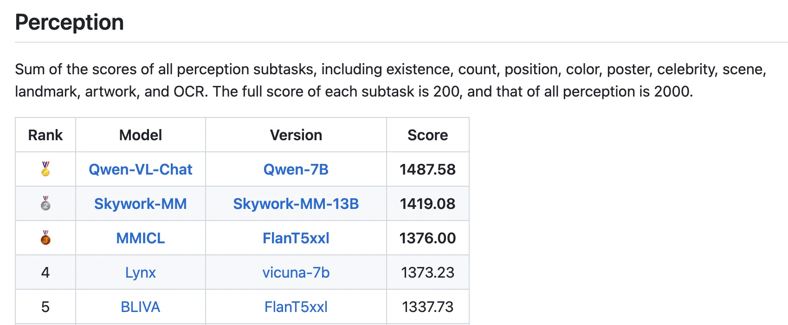
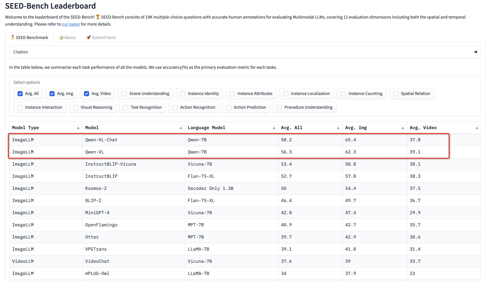

<p align="left">
        <a href="README_CN.md">中文</a>&nbsp ｜ &nbspEnglish&nbsp&nbsp ｜ &nbsp<a href="README_JA.md">日本語</a>&nbsp｜ &nbsp<a href="README_KO.md">한국어</a>&nbsp
</p>
<br><br>

<p align="center">
    
<p>
<br>

<p align="center">
        Qwen-VL <a href="https://modelscope.cn/models/qwen/Qwen-VL/summary">🤖 <a> | <a href="https://huggingface.co/Qwen/Qwen-VL">🤗</a>&nbsp ｜ Qwen-VL-Chat <a href="https://modelscope.cn/models/qwen/Qwen-VL-Chat/summary">🤖 <a>| <a href="https://huggingface.co/Qwen/Qwen-VL-Chat">🤗</a>&nbsp ｜ Qwen-VL-Chat-Int4 <a href="https://huggingface.co/Qwen/Qwen-VL-Chat-Int4">🤗</a>&nbsp&nbsp | &nbsp Qwen-VL-Plus <a href="https://tongyi.aliyun.com/qianwen">Web</a> | <a href="https://help.aliyun.com/zh/dashscope/developer-reference/vl-plus-quick-start">API</a>
<br>
<a href="assets/wechat.png">WeChat</a>&nbsp&nbsp | &nbsp&nbsp<a href="https://discord.gg/z3GAxXZ9Ce">Discord</a>&nbsp&nbsp | &nbsp&nbsp<a href="https://modelscope.cn/studios/qwen/Qwen-VL-Chat-Demo/summary">Demo</a>&nbsp ｜ &nbsp<a href="https://arxiv.org/abs/2308.12966">Paper</a>&nbsp&nbsp | &nbsp&nbsp<a href="https://github.com/camenduru/Qwen-VL-Chat-colab">Colab</a>&nbsp&nbsp | &nbsp <a href="TUTORIAL.md">Tutorial</a>
</p>
<br><br>

---
## Qwen-VL-Plus

Qwen-VL-Plus is the upgraded version of Qwen-VL, currently supporting access for free through [Web pages](https://qianwen.aliyun.com), [🤖](https://modelscope.cn/studios/qwen/Qwen-VL-Chat-Demo/summary)and [APIs](https://help.aliyun.com/zh/dashscope/developer-reference/vl-plus-quick-start/).
Key features of Qwen-VL-Plus include:

- Significantly enhanced capabilities for text processing within images have been achieved, particularly excelling in the recognition of Chinese characters compared to GPT-4V. These advancements make it an efficient tool for tasks like extracting, organizing, and summarizing textual information from images.
- Expanded range of supported image resolutions: Allowing the model to handle images of different aspect ratios and sizes, including larger and longer images.
- Enhanced visual reasoning and decision-making abilities: Users can take a picture of a math problem and send it to Qwen-VL-Plus, which will help them solve it step-by-step.

<table>
<thead>
  <tr>
    <th>Model</th>
    <th>DocVQA<sup>(test)</sup></th>
    <th>ChartQA<sup>(test)</sup></th>
    <th>AI2D<sup>(test)</sup></th>
    <th>TextVQA<sup>(val)</sup></th>
    <th>MMMU<sup>(val)</sup></th>
    <th>MathVista<sup>(testmini)</sup></th>
  </tr>
</thead>
<tbody align="center">
  <tr>
    <td>Other Best Generalist LVLM</td>
    <td>81.6%<br><sub>(CogAgent)</sub></td>
    <td>68.4%<br><sub>(CogAgent)</sub></td>
    <td>73.7%<br><sub>(Fuyu-Medium)</sub></td>
    <td>76.1%<br><sub>(CogAgent)</sub></td>
    <td>36.4%<br><sub>(LLaVA-1.5)</sub></td>
    <td>36.7%<br><sub>(SPHINX-V2)</sub></td>
  </tr>
  <tr>
    <td>Gemini Pro</td>
    <td>88.1%</td>
    <td>74.1%</td>
    <td>73.9%</td>
    <td>74.6%</td>
    <td>47.9%</td>
    <td>45.2%</td>
  </tr>
  <tr>
    <td>Gemini Ultra</td>
    <td>90.9%</td>
    <td><b>80.8%</b></td>
    <td><b>79.5%</b></td>
    <td><b>82.3%</b></td>
    <td><b>59.4%</b></td>
    <td><b>53.0%</b></td>
  </tr>
  <tr>
    <td>GPT-4V</td>
    <td>88.4%</td>
    <td>78.5%</td>
    <td>78.2%</td>
    <td>78.0%</td>
    <td>56.8%</td>
    <td>49.9%</td>
  </tr>
  <tr>
    <td><b>Qwen-VL-Plus</b></td>
    <td><b>91.4% <sup>1</sup></b></td>
    <td>78.1% <sup>3</sup></td>
    <td>75.9% <sup>3</sup></td>
    <td>78.9% <sup>2</sup></td>
    <td>46.5% <sup>4</sup></td>
    <td>41.0% <sup>4</sup></td>
  </tr>
</tbody>
</table>

All numbers are obtained without any use of external OCR tools ('pixel only'). Besides, Qwen-VL-Plus achieves SOTA on [MM-Bench](https://mmbench.opencompass.org.cn/leaderboard), [MME](https://github.com/BradyFU/Awesome-Multimodal-Large-Language-Models/tree/Evaluation) and [Seed-Bench-v1](https://huggingface.co/spaces/AILab-CVC/SEED-Bench_Leaderboard).

---
## Qwen-VL

**Qwen-VL** (Qwen Large Vision Language Model) is the multimodal version of the large model series, Qwen (abbr. Tongyi Qianwen), proposed by Alibaba Cloud. Qwen-VL accepts image, text, and bounding box as inputs, outputs text and bounding box. The features of Qwen-VL include:

- **Strong performance**: It significantly surpasses existing open-sourced Large Vision Language Models (LVLM) under similar model scale on multiple English evaluation benchmarks (including Zero-shot Captioning, VQA, DocVQA, and Grounding).
- **Multi-lingual LVLM supporting text recognition**: Qwen-VL naturally supports English, Chinese, and multi-lingual conversation, and it promotes end-to-end recognition of Chinese and English bi-lingual text in images.
- **Multi-image interleaved conversations**: This feature allows for the input and comparison of multiple images, as well as the ability to specify questions related to the images and engage in multi-image storytelling.
- **First generalist model supporting grounding in Chinese**: Detecting bounding boxes through open-domain language expression in both Chinese and English.
- **Fine-grained recognition and understanding**: Compared to the 224\*224 resolution currently used by other open-sourced LVLM, the 448\*448 resolution promotes fine-grained text recognition, document QA, and bounding box annotation.

<br>
<p align="center">
    
<p>
<br>

We release two models of the Qwen-VL series:

- Qwen-VL: The pre-trained LVLM model uses Qwen-7B as the initialization of the LLM, and [Openclip ViT-bigG](https://github.com/mlfoundations/open_clip) as the initialization of the visual encoder. And connects them with a randomly initialized cross-attention layer.
- Qwen-VL-Chat: A multimodal LLM-based AI assistant, which is trained with alignment techniques. Qwen-VL-Chat supports more flexible interaction, such as multiple image inputs, multi-round question answering, and creative capabilities.
  <br>

## News and Updates
* ```2023.11.28``` 🏆🏆🏆 Qwen-VL-Plus achieved the best performance in [DOCVQA](https://rrc.cvc.uab.es/?ch=17&com=evaluation&task=1) by using a single model, surpassing GPT4V and PALI-X, without using model ensemble or OCR-pipeline. Meanwhile, it is also a general model that can help you analyze and understand various tasks by directly inputting images. You can enjoy the new model by directly visiting the multi-modal tab of [web pages](https://qianwen.aliyun.com).
* ```2023.9.25``` 🚀🚀🚀 We update Qwen-VL-Chat with more robust Chinese instruction-following ability, improved understanding of web pages and table images, and better dialogue performance (Touchstone: CN: 401.2->481.7, EN: 645.2->711.6).
* ```2023.9.12``` 😃😃😃 We now support finetuning on the Qwen-VL models, including full-parameter finetuning, LoRA and Q-LoRA.
* ```2023.9.8``` 👍👍👍 Thanks to [camenduru](https://github.com/camenduru) for contributing the wonderful [Colab](https://github.com/camenduru/Qwen-VL-Chat-colab). Everyone can use it as a local or online Qwen-VL-Chat-Int4 Demo tutorial on one 12G GPU.
* ```2023.9.5``` 👏👏👏 Qwen-VL-Chat achieves SOTAs on [MME Benchmark](https://github.com/BradyFU/Awesome-Multimodal-Large-Language-Models/tree/Evaluation), a comprehensive evaluation benchmark for multimodal large language models. It measures both perception and cognition abilities on a total of 14 subtasks.
* ```2023.9.4``` ⭐⭐⭐ Qwen-VL series achieve SOTAs on [Seed-Bench](https://huggingface.co/spaces/AILab-CVC/SEED-Bench_Leaderboard), a multimodal benchmark of 19K multiple-choice questions with accurate human annotations for evaluating Multimodal LLMs including both image and video understanding.
* ```2023.9.1``` 🔥🔥🔥 We release the [TouchStone](https://github.com/OFA-Sys/TouchStone) Evaluation, which is a comprehensive assessment of multimodal language models, encompassing not only basic recognition and comprehension but also extending to literary creation. By using strong LLMs as judges and converting multimodal information into text.
* ```2023.8.31``` 🌟🌟🌟 We release the Int4 quantized model for Qwen-VL-Chat, **Qwen-VL-Chat-Int4**, which requires low memory costs but achieves improved inference speed. Besides, there is no significant performance degradation on the benchmark evaluation.
* ```2023.8.22``` 🎉🎉🎉 We release both **Qwen-VL** and **Qwen-VL-Chat** on ModelScope and Hugging Face. We also provide a [paper](https://arxiv.org/abs/2308.12966) for more details about the model, including training details and model performance.


## Evaluation

We evaluated the model's abilities from three perspectives:

1. **Standard Benchmarks**: We evaluate the model's basic task capabilities on four major categories of multimodal tasks:
   
   - Zero-shot Captioning: Evaluate model's zero-shot image captioning ability on unseen datasets;
   - General VQA: Evaluate the general question-answering ability of pictures, such as the judgment, color, number, category, etc;
   - Text-based VQA: Evaluate the model's ability to recognize text in pictures, such as document QA, chart QA, etc;
   - Referring Expression Comprehension: Evaluate the ability to localize a target object in an image described by a referring expression.
2. **TouchStone**: To evaluate the overall text-image dialogue capability and alignment level with humans, we have constructed a benchmark called [TouchStone](https://github.com/OFA-Sys/TouchStone), which is based on scoring with GPT4 to evaluate the LVLM model.
   
   - The TouchStone benchmark covers a total of 300+ images, 800+ questions, and 27 categories. Such as attribute-based Q&A, celebrity recognition, writing poetry, summarizing multiple images, product comparison, math problem solving, etc;
   - In order to break the current limitation of GPT4 in terms of direct image input, TouchStone provides fine-grained image annotations by human labeling. These detailed annotations, along with the questions and the model's output, are then presented to GPT4 for scoring.
   - The benchmark includes both English and Chinese versions.
  
3. **Other Multimodal Benchmarks**: We also evaluated our model's capabilities in other multimodal benchmarks:

   - [MME Benchmark](https://github.com/BradyFU/Awesome-Multimodal-Large-Language-Models/tree/Evaluation), a comprehensive evaluation benchmark for multimodal large language models. Qwen-VL-Chat achieves SOTAs on both perception and cognition tracks.
   - [Seed-Bench](https://huggingface.co/spaces/AILab-CVC/SEED-Bench_Leaderboard), a multimodal benchmark of 19K multiple-choice questions with accurate human annotations for evaluating Multimodal LLMs. Qwen series achieves SOTAs on this benchmark.

The results of the evaluation are as follows:

Qwen-VL outperforms current SOTA generalist models on multiple VL tasks and has a more comprehensive coverage in terms of capability range.

<p align="center">
    
<p>

### Zero-shot Captioning & General VQA

<table>
<thead>
  <tr>
    <th rowspan="2">Model type</th>
    <th rowspan="2">Model</th>
    <th colspan="2">Zero-shot Captioning</th>
    <th colspan="5">General VQA</th>
  </tr>
  <tr>
    <th>NoCaps</th>
    <th>Flickr30K</th>
    <th>VQAv2<sup>dev</sup></th>
    <th>OK-VQA</th>
    <th>GQA</th>
    <th>SciQA-Img<br>(0-shot)</th>
    <th>VizWiz<br>(0-shot)</th>
  </tr>
</thead>
<tbody align="center">
  <tr>
    <td rowspan="10">Generalist<br>Models</td>
    <td>Flamingo-9B</td>
    <td>-</td>
    <td>61.5</td>
    <td>51.8</td>
    <td>44.7</td>
    <td>-</td>
    <td>-</td>
    <td>28.8</td>
  </tr>
  <tr>
    <td>Flamingo-80B</td>
    <td>-</td>
    <td>67.2</td>
    <td>56.3</td>
    <td>50.6</td>
    <td>-</td>
    <td>-</td>
    <td>31.6</td>
  </tr>
  <tr>
    <td>Unified-IO-XL</td>
    <td>100.0</td>
    <td>-</td>
    <td>77.9</td>
    <td>54.0</td>
    <td>-</td>
    <td>-</td>
    <td>-</td>
  </tr>
  <tr>
    <td>Kosmos-1</td>
    <td>-</td>
    <td>67.1</td>
    <td>51.0</td>
    <td>-</td>
    <td>-</td>
    <td>-</td>
    <td>29.2</td>
  </tr>
  <tr>
    <td>Kosmos-2</td>
    <td>-</td>
    <td>80.5</td>
    <td>51.1</td>
    <td>-</td>
    <td>-</td>
    <td>-</td>
    <td>-</td>
  </tr>
  <tr>
    <td>BLIP-2 (Vicuna-13B)</td>
    <td>103.9</td>
    <td>71.6</td>
    <td>65.0</td>
    <td>45.9</td>
    <td>32.3</td>
    <td>61.0</td>
    <td>19.6</td>
  </tr>
  <tr>
    <td>InstructBLIP (Vicuna-13B)</td>
    <td><strong>121.9</strong></td>
    <td>82.8</td>
    <td>-</td>
    <td>-</td>
    <td>49.5</td>
    <td>63.1</td>
    <td>33.4</td>
  </tr>
  <tr>
    <td>Shikra (Vicuna-13B)</td>
    <td>-</td>
    <td>73.9</td>
    <td>77.36</td>
    <td>47.16</td>
    <td>-</td>
    <td>-</td>
    <td>-</td>
  </tr>
  <tr>
    <td><strong>Qwen-VL (Qwen-7B)</strong></td>
    <td>121.4</td>
    <td><b>85.8</b></td>
    <td><b>78.8</b></td>
    <td><b>58.6</b></td>
    <td><b>59.3</b></td>
    <td>67.1</td>
    <td>35.2</td>
  </tr>
  <!-- <tr>
    <td>Qwen-VL (4-shot)</td>
    <td>-</td>
    <td>-</td>
    <td>-</td>
    <td>63.6</td>
    <td>-</td>
    <td>-</td>
    <td>39.1</td>
  </tr> -->
  <tr>
    <td>Qwen-VL-Chat</td>
    <td>120.2</td>
    <td>81.0</td>
    <td>78.2</td>
    <td>56.6</td>
    <td>57.5</td>
    <td><b>68.2</b></td>
    <td><b>38.9</b></td>
  </tr>
  <!-- <tr>
    <td>Qwen-VL-Chat (4-shot)</td>
    <td>-</td>
    <td>-</td>
    <td>-</td>
    <td>60.6</td>
    <td>-</td>
    <td>-</td>
    <td>44.45</td>
  </tr> -->
  <tr>
    <td>Previous SOTA<br>(Per Task Fine-tuning)</td>
    <td>-</td>
    <td>127.0<br>(PALI-17B)</td>
    <td>84.5<br>(InstructBLIP<br>-FlanT5-XL)</td>
    <td>86.1<br>(PALI-X<br>-55B)</td>
    <td>66.1<br>(PALI-X<br>-55B)</td>
    <td>72.1<br>(CFR)</td>
    <td>92.53<br>(LLaVa+<br>GPT-4)</td>
    <td>70.9<br>(PALI-X<br>-55B)</td>
  </tr>
</tbody>
</table>

- For zero-shot image captioning, Qwen-VL achieves the **SOTA** on Flickr30K and competitive results on Nocaps with InstructBlip.
- For general VQA, Qwen-VL achieves the **SOTA** under the same generalist LVLM scale settings.

### Text-oriented VQA (Focused on text understanding capabilities in images)

<table>
<thead>
  <tr>
    <th>Model type</th>
    <th>Model</th>
    <th>TextVQA</th>
    <th>DocVQA</th>
    <th>ChartQA</th>
    <th>AI2D</th>
    <th>OCR-VQA</th>
  </tr>
</thead>
<tbody align="center">
  <tr>
    <td rowspan="5">Generalist Models</td>
    <td>BLIP-2 (Vicuna-13B)</td>
    <td>42.4</td>
    <td>-</td>
    <td>-</td>
    <td>-</td>
    <td>-</td>
  </tr>
  <tr>
    <td>InstructBLIP (Vicuna-13B)</td>
    <td>50.7</td>
    <td>-</td>
    <td>-</td>
    <td>-</td>
    <td>-</td>
  </tr>
  <tr>
    <td>mPLUG-DocOwl (LLaMA-7B)</td>
    <td>52.6</td>
    <td>62.2</td>
    <td>57.4</td>
    <td>-</td>
    <td>-</td>
  </tr>
  <tr>
    <td>Pix2Struct-Large (1.3B)</td>
    <td>-</td>
    <td><b>76.6</b></td>
    <td>58.6</td>
    <td>42.1</td>
    <td>71.3</td>
  </tr>
  <tr>
    <td>Qwen-VL (Qwen-7B)</td>
    <td><b>63.8</b></td>
    <td>65.1</td>
    <td><b>65.7</b></td>
    <td><b>62.3</b></td>
    <td><b>75.7</b></td>
  </tr>
  <tr>
    <td>Specialist SOTAs<br>(Specialist/Finetuned)</td>
    <td>PALI-X-55B (Single-task FT)<br>(Without OCR Pipeline)</td>
    <td>71.44</td>
    <td>80.0</td>
    <td>70.0</td>
    <td>81.2</td>
    <td>75.0</td>
  </tr>
</tbody>
</table>

- In text-related recognition/QA evaluation, Qwen-VL achieves the SOTA under the generalist LVLM scale settings.
- Resolution is important for several above evaluations. While most open-sourced LVLM models with 224 resolution are incapable of these evaluations or can only solve these by cutting images, Qwen-VL scales the resolution to 448 so that it can be evaluated end-to-end. Qwen-VL even outperforms Pix2Struct-Large models of 1024 resolution on some tasks.

### Referring Expression Comprehension

<table>
<thead>
  <tr>
    <th rowspan="2">Model type</th>
    <th rowspan="2">Model</th>
    <th colspan="3">RefCOCO</th>
    <th colspan="3">RefCOCO+</th>
    <th colspan="2">RefCOCOg</th>
    <th>GRIT</th>
  </tr>
  <tr>
    <th>val</th>
    <th>test-A</th>
    <th>test-B</th>
    <th>val</th>
    <th>test-A</th>
    <th>test-B</th>
    <th>val-u</th>
    <th>test-u</th>
    <th>refexp</th>
  </tr>
</thead>
<tbody align="center">
  <tr>
    <td rowspan="8">Generalist Models</td>
    <td>GPV-2</td>
    <td>-</td>
    <td>-</td>
    <td>-</td>
    <td>-</td>
    <td>-</td>
    <td>-</td>
    <td>-</td>
    <td>-</td>
    <td>51.50</td>
  </tr>
  <tr>
    <td>OFA-L*</td>
    <td>79.96</td>
    <td>83.67</td>
    <td>76.39</td>
    <td>68.29</td>
    <td>76.00</td>
    <td>61.75</td>
    <td>67.57</td>
    <td>67.58</td>
    <td>61.70</td>
  </tr>
  <tr>
    <td>Unified-IO</td>
    <td>-</td>
    <td>-</td>
    <td>-</td>
    <td>-</td>
    <td>-</td>
    <td>-</td>
    <td>-</td>
    <td>-</td>
    <td><b>78.61</b></td>
  </tr>
  <tr>
    <td>VisionLLM-H</td>
    <td></td>
    <td>86.70</td>
    <td>-</td>
    <td>-</td>
    <td>-</td>
    <td>-</td>
    <td>-</td>
    <td>-</td>
    <td>-</td>
  </tr>
  <tr>
    <td>Shikra-7B</td>
    <td>87.01</td>
    <td>90.61</td>
    <td>80.24 </td>
    <td>81.60</td>
    <td>87.36</td>
    <td>72.12</td>
    <td>82.27</td>
    <td>82.19</td>
    <td>69.34</td>
  </tr>
  <tr>
    <td>Shikra-13B</td>
    <td>87.83 </td>
    <td>91.11</td>
    <td>81.81</td>
    <td>82.89</td>
    <td>87.79</td>
    <td>74.41</td>
    <td>82.64</td>
    <td>83.16</td>
    <td>69.03</td>
  </tr>
  <tr>
    <td>Qwen-VL-7B</td>
    <td><b>89.36</b></td>
    <td>92.26</td>
    <td><b>85.34</b></td>
    <td><b>83.12</b></td>
    <td>88.25</td>
    <td><b>77.21</b></td>
    <td>85.58</td>
    <td>85.48</td>
    <td>78.22</td>
  </tr>
  <tr>
    <td>Qwen-VL-7B-Chat</td>
    <td>88.55</td>
    <td><b>92.27</b></td>
    <td>84.51</td>
    <td>82.82</td>
    <td><b>88.59</b></td>
    <td>76.79</td>
    <td><b>85.96</b></td>
    <td><b>86.32</b></td>
    <td>-</td>
  <tr>
    <td rowspan="3">Specialist SOTAs<br>(Specialist/Finetuned)</td>
    <td>G-DINO-L</td>
    <td>90.56</td>
    <td>93.19</td>
    <td>88.24</td>
    <td>82.75</td>
    <td>88.95</td>
    <td>75.92</td>
    <td>86.13</td>
    <td>87.02</td>
    <td>-</td>
  </tr>
  <tr>
    <td>UNINEXT-H</td>
    <td>92.64 </td>
    <td>94.33</td>
    <td>91.46</td>
    <td>85.24</td>
    <td>89.63</td>
    <td>79.79</td>
    <td>88.73</td>
    <td>89.37</td>
    <td>-</td>
  </tr>
  <tr>
    <td>ONE-PEACE</td>
    <td>92.58 </td>
    <td>94.18</td>
    <td>89.26</td>
    <td>88.77</td>
    <td>92.21</td>
    <td>83.23</td>
    <td>89.22</td>
    <td>89.27</td>
    <td>-</td>
  </tr>
</tbody>
</table>

- Qwen-VL achieves the **SOTA** in all above referring expression comprehension benchmarks.
- Qwen-VL has not been trained on any Chinese grounding data, but it can still generalize to the Chinese Grounding tasks in a zero-shot way by training Chinese Caption data and English Grounding data.

We provide all of the above evaluation scripts for reproducing our experimental results. Please read [eval_mm/EVALUATION.md](eval_mm/EVALUATION.md) for more information.

### Chat evaluation

TouchStone is a benchmark based on scoring with GPT4 to evaluate the abilities of the LVLM model on text-image dialogue and alignment levels with humans. It covers a total of 300+ images, 800+ questions, and 27 categories, such as attribute-based Q&A, celebrity recognition, writing poetry, summarizing multiple images, product comparison, math problem solving, etc. Please read [touchstone/README.md](touchstone/README.md) for more information.

#### English evaluation

| Model            | Score |
| ---------------- | ----- |
| PandaGPT         | 488.5 |
| MiniGPT4         | 531.7 |
| InstructBLIP     | 552.4 |
| LLaMA-AdapterV2  | 590.1 |
| LLaVA            | 602.7 |
| mPLUG-Owl        | 605.4 |
| Qwen-VL-Chat     | 645.2 |
| Qwen-VL-Chat-1.1 | 711.6 |

#### Chinese evaluation

| Model            | Score |
| ---------------- | ----- |
| VisualGLM        | 247.1 |
| Qwen-VL-Chat     | 401.2 |
| Qwen-VL-Chat-1.1 | 481.7 |

Qwen-VL-Chat has achieved the best results in both Chinese and English alignment evaluation.

### Other Benchmarks

#### MME Benchmark

[MME](https://github.com/BradyFU/Awesome-Multimodal-Large-Language-Models/tree/Evaluation) is a comprehensive evaluation benchmark for multimodal large language models. It measures both perception and cognition abilities on a total of 14 subtasks, including existence, count, position, color, poster, celebrity, scene, landmark, artwork, OCR, commonsense reasoning, numerical calculation, text translation, and code reasoning.

Qwen-VL-Chat achieves SOTAs on both perception and cognition evaluation. See more details on [HERE](eval_mm/mme/EVAL_MME.md).

<p align="center">
    
<p>
<p align="center">
    
<p>

#### SEED-Bench

[SEED-Bench](https://huggingface.co/spaces/AILab-CVC/SEED-Bench_Leaderboard) is a multimodal benchmark of 19K multiple-choice questions with accurate human annotations for evaluating Multimodal LLMs, covering 12 evaluation dimensions including both **image** and **video** understanding. See more details on [HERE](eval_mm/seed_bench/EVAL_SEED.md).

Qwen-VL and Qwen-VL-Chat achieve SOTAs on this benchmark.

<p align="center">
    
<p>

## Requirements

* python 3.8 and above
* pytorch 1.12 and above, 2.0 and above are recommended
* CUDA 11.4 and above are recommended (this is for GPU users)
  <br>

## Quickstart

Below, we provide simple examples to show how to use Qwen-VL and Qwen-VL-Chat with 🤖 ModelScope and 🤗 Transformers.

Before running the code, make sure you have setup the environment and installed the required packages. Make sure you meet the above requirements, and then install the dependent libraries.

```bash
pip install -r requirements.txt
```

Now you can start with ModelScope or Transformers. More usage aboue vision encoder, please refer to the [tutorial](TUTORIAL.md).

#### 🤗 Transformers

To use Qwen-VL-Chat for the inference, all you need to do is to input a few lines of codes as demonstrated below. However, **please make sure that you are using the latest code.**

```python
from transformers import AutoModelForCausalLM, AutoTokenizer
from transformers.generation import GenerationConfig
import torch
torch.manual_seed(1234)

# Note: The default behavior now has injection attack prevention off.
tokenizer = AutoTokenizer.from_pretrained("Qwen/Qwen-VL-Chat", trust_remote_code=True)

# use bf16
# model = AutoModelForCausalLM.from_pretrained("Qwen/Qwen-VL-Chat", device_map="auto", trust_remote_code=True, bf16=True).eval()
# use fp16
# model = AutoModelForCausalLM.from_pretrained("Qwen/Qwen-VL-Chat", device_map="auto", trust_remote_code=True, fp16=True).eval()
# use cpu only
# model = AutoModelForCausalLM.from_pretrained("Qwen/Qwen-VL-Chat", device_map="cpu", trust_remote_code=True).eval()
# use cuda device
model = AutoModelForCausalLM.from_pretrained("Qwen/Qwen-VL-Chat", device_map="cuda", trust_remote_code=True).eval()

# Specify hyperparameters for generation
model.generation_config = GenerationConfig.from_pretrained("Qwen/Qwen-VL-Chat", trust_remote_code=True)

# 1st dialogue turn
query = tokenizer.from_list_format([
    {'image': 'https://qianwen-res.oss-cn-beijing.aliyuncs.com/Qwen-VL/assets/demo.jpeg'}, # Either a local path or an url
    {'text': '这是什么?'},
])
response, history = model.chat(tokenizer, query=query, history=None)
print(response)
# 图中是一名女子在沙滩上和狗玩耍，旁边是一只拉布拉多犬，它们处于沙滩上。

# 2nd dialogue turn
response, history = model.chat(tokenizer, '框出图中击掌的位置', history=history)
print(response)
# <ref>击掌</ref><box>(536,509),(588,602)</box>
image = tokenizer.draw_bbox_on_latest_picture(response, history)
if image:
  image.save('1.jpg')
else:
  print("no box")
```

<p align="center">
    
<p>

<details>
  <summary>Running Qwen-VL</summary>

Running Qwen-VL pretrained base model is also simple.

```python
from transformers import AutoModelForCausalLM, AutoTokenizer
from transformers.generation import GenerationConfig
import torch
torch.manual_seed(1234)

tokenizer = AutoTokenizer.from_pretrained("Qwen/Qwen-VL", trust_remote_code=True)

# use bf16
# model = AutoModelForCausalLM.from_pretrained("Qwen/Qwen-VL", device_map="auto", trust_remote_code=True, bf16=True).eval()
# use fp16
# model = AutoModelForCausalLM.from_pretrained("Qwen/Qwen-VL", device_map="auto", trust_remote_code=True, fp16=True).eval()
# use cpu only
# model = AutoModelForCausalLM.from_pretrained("Qwen/Qwen-VL", device_map="cpu", trust_remote_code=True).eval()
# use cuda device
model = AutoModelForCausalLM.from_pretrained("Qwen/Qwen-VL", device_map="cuda", trust_remote_code=True).eval()

# Specify hyperparameters for generation (No need to do this if you are using transformers>4.32.0)
# model.generation_config = GenerationConfig.from_pretrained("Qwen/Qwen-VL", trust_remote_code=True)

query = tokenizer.from_list_format([
    {'image': 'https://qianwen-res.oss-cn-beijing.aliyuncs.com/Qwen-VL/assets/demo.jpeg'}, # Either a local path or an url
    {'text': 'Generate the caption in English with grounding:'},
])
inputs = tokenizer(query, return_tensors='pt')
inputs = inputs.to(model.device)
pred = model.generate(**inputs)
response = tokenizer.decode(pred.cpu()[0], skip_special_tokens=False)
print(response)
# https://qianwen-res.oss-cn-beijing.aliyuncs.com/Qwen-VL/assets/demo.jpeg</img>Generate the caption in English with grounding:<ref> Woman</ref><box>(451,379),(731,806)</box> and<ref> her dog</ref><box>(219,424),(576,896)</box> playing on the beach<|endoftext|>
image = tokenizer.draw_bbox_on_latest_picture(response)
if image:
  image.save('2.jpg')
else:
  print("no box")
```

<p align="center">
    
<p>

</details>


In the event of a network issue while attempting to download model checkpoints and codes from HuggingFace, an alternative approach is to initially fetch the checkpoint from ModelScope and then load it from the local directory as outlined below:

```python
from modelscope import snapshot_download
from transformers import AutoModelForCausalLM, AutoTokenizer

# Downloading model checkpoint to a local dir model_dir
# model_dir = snapshot_download('qwen/Qwen-VL')
model_dir = snapshot_download('qwen/Qwen-VL-Chat')


# Loading local checkpoints
# trust_remote_code is still set as True since we still load codes from local dir instead of transformers
tokenizer = AutoTokenizer.from_pretrained(model_dir, trust_remote_code=True)
model = AutoModelForCausalLM.from_pretrained(
    model_dir,
    device_map="cuda",
    trust_remote_code=True
).eval()
```

#### 🤖 ModelScope

ModelScope is an opensource platform for Model-as-a-Service (MaaS), which provides flexible and cost-effective model service to AI developers. Similarly, you can run the models with ModelScope as shown below:

```python
from modelscope import (
    snapshot_download, AutoModelForCausalLM, AutoTokenizer, GenerationConfig
)
import torch
model_id = 'qwen/Qwen-VL-Chat'
revision = 'v1.0.0'

model_dir = snapshot_download(model_id, revision=revision)
torch.manual_seed(1234)

tokenizer = AutoTokenizer.from_pretrained(model_dir, trust_remote_code=True)
if not hasattr(tokenizer, 'model_dir'):
    tokenizer.model_dir = model_dir
# use bf16
# model = AutoModelForCausalLM.from_pretrained(model_dir, device_map="auto", trust_remote_code=True, bf16=True).eval()
# use fp16
model = AutoModelForCausalLM.from_pretrained(model_dir, device_map="auto", trust_remote_code=True, fp16=True).eval()
# use cpu
# model = AutoModelForCausalLM.from_pretrained(model_dir, device_map="cpu", trust_remote_code=True).eval()
# use auto
model = AutoModelForCausalLM.from_pretrained(model_dir, device_map="auto", trust_remote_code=True).eval()

# Specify hyperparameters for generation (No need to do this if you are using transformers>=4.32.0)
# model.generation_config = GenerationConfig.from_pretrained(model_dir, trust_remote_code=True)

# 1st dialogue turn
# Either a local path or an url between </img> tags.
image_path = 'https://qianwen-res.oss-cn-beijing.aliyuncs.com/Qwen-VL/assets/demo.jpeg'
response, history = model.chat(tokenizer, query=f'{image_path}</img>这是什么', history=None)
print(response)
# 图中是一名年轻女子在沙滩上和她的狗玩耍，狗的品种是拉布拉多。她们坐在沙滩上，狗的前腿抬起来，与人互动。

# 2nd dialogue turn
response, history = model.chat(tokenizer, '输出击掌的检测框', history=history)
print(response)
# <ref>"击掌"</ref><box>(211,412),(577,891)</box>
image = tokenizer.draw_bbox_on_latest_picture(response, history)
if image:
  image.save('output_chat.jpg')
else:
  print("no box")
```

<p align="center">
    
<p>
<br>

## Quantization

### Usage

We provide a new solution based on [AutoGPTQ](https://github.com/PanQiWei/AutoGPTQ), and release an Int4 quantized model for Qwen-VL-Chat, Qwen-VL-Chat-Int4 [Click here](https://huggingface.co/Qwen/Qwen-VL-Chat-Int4), which achieves nearly lossless model effects but improved performance on both memory costs and inference speed.

Here we demonstrate how to use our provided quantized models for inference. Before you start, make sure you meet the requirements (e.g., torch 2.0 and above, transformers 4.32.0 and above, etc.) and install the required packages:

```bash
pip install optimum
git clone https://github.com/JustinLin610/AutoGPTQ.git & cd AutoGPTQ
pip install -v .
```

If you meet problems installing `auto-gptq`, we advise you to check out the official [repo](https://github.com/PanQiWei/AutoGPTQ) to find a wheel.

Then you can load the quantized model easily and run inference as same as usual:

```python
model = AutoModelForCausalLM.from_pretrained(
    "Qwen/Qwen-VL-Chat-Int4",
    device_map="auto",
    trust_remote_code=True
).eval()
# Either a local path or an url between </img> tags.
image_path = 'https://qianwen-res.oss-cn-beijing.aliyuncs.com/Qwen-VL/assets/demo.jpeg'
response, history = model.chat(tokenizer, query=f'{image_path}</img>这是什么', history=None)
print(response)
```

### Performance

We illustrate the model performance of both BF16 and Int4 models on the benchmark **[TouchStone](https://github.com/OFA-Sys/TouchStone)**, and we find that the quantized model does not suffer from significant performance degradation. Results are shown below:

| Quantization | ZH         | EN            |
| ------------ | :--------: | :-----------: | 
| BF16         | 401.2      |    645.2      |
| Int4         | 386.6      |    651.4      |

### Inference Speed

We measured the average inference speed (tokens/s) of generating 1792 (2048-258) and 7934 (8192-258) tokens with the context of an image (which takes 258 tokens) under BF16 precision and Int4 quantization, respectively.

| Quantization | Speed (2048 tokens) | Speed (8192 tokens) |
| ------------ | :-----------------: | :-----------------: |
| BF16         |        28.87        |        24.32        |
| Int4         |        37.79        |        34.34        |

The profiling runs on a single A100-SXM4-80G GPU with PyTorch 2.0.1 and CUDA 11.4.

### GPU Memory Usage

We also profile the peak GPU memory usage for encoding 1792 (2048-258) tokens (including an image) as context (and generating single token) and generating 7934 (8192-258) tokens (with an image as context) under BF16 or Int4 quantization level, respectively. The results are shown below.

| Quantization | Peak Usage for Encoding 2048 Tokens | Peak Usage for Generating 8192 Tokens |
| ------------ | :---------------------------------: | :-----------------------------------: |
| BF16         |               22.60GB               |                28.01GB                |
| Int4         |               11.82GB               |                17.23GB                |

The above speed and memory profiling are conducted using [this script](https://qianwen-res.oss-cn-beijing.aliyuncs.com/profile_mm.py).
<br>

## Finetuning

Now we provide the official training script, `finetune.py`, for users to finetune the pretrained model for downstream applications in a simple fashion. Additionally, we provide shell scripts to launch finetuning with no worries. This script supports the training with DeepSpeed and FSDP. The shell scripts that we provide use DeepSpeed, and thus we advise you to install DeepSpeed before you start:

```bash
pip install deepspeed
```

### Data preparation
To prepare your training data, you need to put all the samples into a list and save it to a json file. Each sample is a dictionary consisting of an id and a list for conversation. Below is a simple example list with 1 sample:
```json
[
  {
    "id": "identity_0",
    "conversations": [
      {
        "from": "user",
        "value": "你好"
      },
      {
        "from": "assistant",
        "value": "我是Qwen-VL,一个支持视觉输入的大模型。"
      }
    ]
  },
  {
    "id": "identity_1",
    "conversations": [
      {
        "from": "user",
        "value": "Picture 1: https://qianwen-res.oss-cn-beijing.aliyuncs.com/Qwen-VL/assets/demo.jpeg</img>\n图中的狗是什么品种？"
      },
      {
        "from": "assistant",
        "value": "图中是一只拉布拉多犬。"
      },
      {
        "from": "user",
        "value": "框出图中的格子衬衫"
      },
      {
        "from": "assistant",
        "value": "<ref>格子衬衫</ref><box>(588,499),(725,789)</box>"
      }
    ]
  },
  { 
    "id": "identity_2",
    "conversations": [
      {
        "from": "user",
        "value": "Picture 1: assets/mm_tutorial/Chongqing.jpeg</img>\nPicture 2: assets/mm_tutorial/Beijing.jpeg</img>\n图中都是哪"
      },
      {
        "from": "assistant",
        "value": "第一张图片是重庆的城市天际线，第二张图片是北京的天际线。"
      }
    ]
  }
]
```
For the VL tasks, there are special tokens that are used, including ` </img> <ref> </ref> <box> </box>`.

The picture is represented as `Picture id: img_path</img>\n{your prompt}`, where `id` indicates the position of the image in the conversation, starting from 1. The "img_path" can be a local file path or a web link. 

The coordinate box is expressed as `<box>(x1,y1),(x2,y2)</box>`·, where `(x1, y1)` and `(x2, y2)` are normalized values in the range `[0, 1000)`. Its corresponding text description can be identified by `<ref>text_caption</ref>`. 


After data preparation, you can use the provided shell scripts to run finetuning. Remember to specify the path to the data file, `$DATA`.

The finetuning scripts allow you to perform:
- Full-parameter finetuning
- LoRA
- Q-LoRA

### Full-parameter finetuning
Full-parameter parameter finetuning requires updating all parameters of LLM in the whole training process. In our experiments, frozening the parameters of ViT during the fine-tuning phase achieves better performance. To launch your training, run the following script:

```bash
sh finetune/finetune_ds.sh
```

Remember to specify the correct model name or path, the data path, as well as the output directory in the shell scripts. If you want to make changes, just remove the argument `--deepspeed` or make changes in the DeepSpeed configuration json file based on your requirements. Additionally, this script supports mixed-precision training, and thus you can use `--bf16 True` or `--fp16 True`. Empirically we advise you to use bf16 to make your training consistent with our pretraining and alignment if your machine supports bf16, and thus we use it by default.

### LoRA
Similarly, to run LoRA, use another script to run as shown below. Before you start, make sure that you have installed `peft`. Also, you need to specify your paths to your model, data, and output. We advise you to use absolute path for your pretrained model. This is because LoRA only saves the adapter and the absolute path in the adapter configuration json file is used for finding out the pretrained model to load.

```bash
# Single GPU training
sh finetune/finetune_lora_single_gpu.sh
# Distributed training
sh finetune/finetune_lora_ds.sh
```

In comparison with full-parameter finetuning, LoRA ([paper](https://arxiv.org/abs/2106.09685)) only updates the parameters of adapter layers but keeps the original large language model layers frozen. This allows much fewer memory costs and thus fewer computation costs. 

Note that if you use LoRA to finetune the base language model, e.g., Qwen-VL, instead of chat models, e.g., Qwen-VL-Chat, the script automatically switches the embedding and output layer as trainable parameters. This is because the base language model has no knowledge of special tokens brought by ChatML format. Thus these layers should be updated for the model to understand and predict the tokens. Or in another word, if your training brings in special tokens in LoRA, you should set the layers to trainable parameters by setting `modules_to_save` inside the code. Additionally, we find that there is a significant gap between the memory footprint of LoRA with and without these trainable parameters. Therefore, if you have trouble with memory, we advise you to LoRA finetune the chat models. Check the profile below for more information.

### Q-LoRA
However, if you still suffer from insufficient memory, you can consider Q-LoRA ([paper](https://arxiv.org/abs/2305.14314)), which uses the quantized large language model and other techniques such as paged attention to allow even fewer memory costs. To run Q-LoRA, directly run the following script:

```bash
# Single GPU training
sh finetune/finetune_qlora_single_gpu.sh
# Distributed training
sh finetune/finetune_qlora_ds.sh
```

For Q-LoRA, we advise you to load our provided quantized model, e.g., Qwen-VL-Chat-Int4. 
You **SHOULD NOT** use the bf16 models. Different from full-parameter finetuning and LoRA, only fp16 is supported for Q-LoRA. Besides, for Q-LoRA, the troubles with the special tokens in LoRA still exist. However, as we only provide the Int4 models for chat models, which means the language model has learned the special tokens of ChatML format, you have no worry about the layers. Note that the layers of the Int4 model should not be trainable, and thus if you introduce special tokens in your training, Q-LoRA might not work.


Different from full-parameter finetuning, the training of both LoRA and Q-LoRA only saves the adapter parameters. You can load the finetuned model for inference as shown below:

```python
from peft import AutoPeftModelForCausalLM

model = AutoPeftModelForCausalLM.from_pretrained(
    path_to_adapter, # path to the output directory
    device_map="auto",
    trust_remote_code=True
).eval()
```

If you want to merge the adapters and save the finetuned model as a standalone model (you can only do this with LoRA, and you CANNOT merge the parameters from Q-LoRA), you can run the following codes:

```python
from peft import AutoPeftModelForCausalLM

model = AutoPeftModelForCausalLM.from_pretrained(
    path_to_adapter, # path to the output directory
    device_map="auto",
    trust_remote_code=True
).eval()

merged_model = model.merge_and_unload()
# max_shard_size and safe serialization are not necessary. 
# They respectively work for sharding checkpoint and save the model to safetensors
merged_model.save_pretrained(new_model_directory, max_shard_size="2048MB", safe_serialization=True)
```

Note: For multi-GPU training, you need to specify the proper hyperparameters for distributed training based on your machine. Besides, we advise you to specify your maximum sequence length with the argument --model_max_length, based on your consideration of data, memory footprint, and training speed.


### Profiling of Memory and Speed
We profile the GPU memory and training speed of both LoRA (Base) refers to training the embedding and output layer, while LoRA (Chat) has no trainable embedding and output layer) and Q-LoRA in the setup of single-GPU training. In this test, we experiment on a single A100-SXM4-80G GPU, and we use CUDA 11.8 and Pytorch 2.0. We uniformly use a batch size of 1 and gradient accumulation of 8. Each sample contains an image. We profile the memory (GB) and speed (s/iter) of inputs of different lengths, namely 384, 512, 1024, and 2048. The statistics are listed below:


<table>
    <tr>
 <th rowspan="2">Method</th><th colspan="4" align="center">Sequence Length</th>
    </tr>
    <tr>
        <th align="center">384</th><th align="center">512</th><th align="center">1024</th><th align="center">2048</th>
    </tr>
    <tr>
      <td>LoRA (Base)</td><td align="center">37.1G / 2.3s/it</td><td align="center">37.3G / 2.4s/it</td><td align="center">38.7G / 3.6s/it</td><td align="center">38.7G / 6.1s/it</td>
    </tr>
    <tr>
      <td>LoRA (Chat)</td><td align="center">23.3G / 2.2s/it</td><td align="center">23.6G / 2.3s/it</td><td align="center">25.1G / 3.5s/it</td><td align="center">27.3G / 5.9s/it</td>
    </tr>
    <tr>
        <td>Q-LoRA</td><td align="center">17.0G / 4.2s/it</td><td align="center">17.2G / 4.5s/it</td><td align="center">18.2G / 5.5s/it</td><td align="center">19.3G / 7.9s/it</td>
    </tr>

</table>

<br>

## Demo

### Web UI

We provide code for users to build a web UI demo. Before you start, make sure you install the following packages:

```
pip install -r requirements_web_demo.txt
```

Then run the command below and click on the generated link:

```
python web_demo_mm.py
```

<br>

## FAQ

If you meet problems, please refer to [FAQ](FAQ.md) and the issues first to search a solution before you launch a new issue.
<br>

## License Agreement

Researchers and developers are free to use the codes and model weights of both Qwen-VL and Qwen-VL-Chat. We also allow their commercial use. Check our license at [LICENSE](LICENSE) for more details.
<br>

## Citation

If you find our paper and code useful in your research, please consider giving a star :star: and citation :pencil: :)

```BibTeX
@article{Qwen-VL,
  title={Qwen-VL: A Versatile Vision-Language Model for Understanding, Localization, Text Reading, and Beyond},
  author={Bai, Jinze and Bai, Shuai and Yang, Shusheng and Wang, Shijie and Tan, Sinan and Wang, Peng and Lin, Junyang and Zhou, Chang and Zhou, Jingren},
  journal={arXiv preprint arXiv:2308.12966},
  year={2023}
}
```

<br>

## Contact Us

If you are interested to leave a message to either our research team or product team, feel free to send an email to qianwen_opensource@alibabacloud.com.

