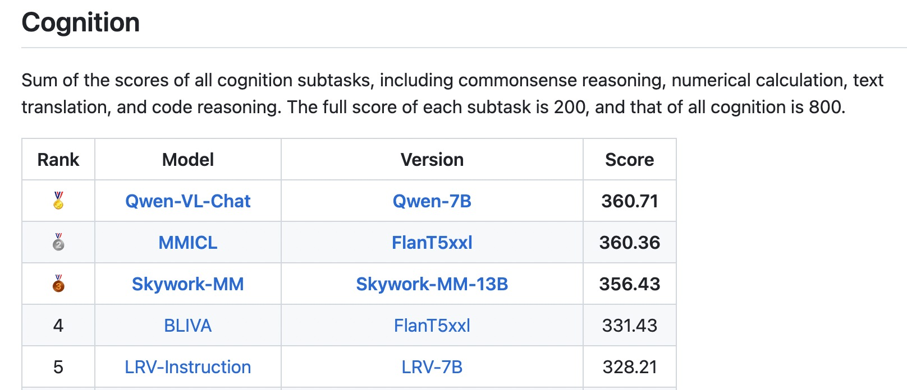

<p align="left">
        中文</a>&nbsp ｜ &nbsp<a href="README.md">English</a> ｜ &nbsp<a href="README_JA.md">日本語</a>&nbsp
</p>
<br><br>

<p align="center">
    
<p>
<br>

<p align="center">
        Qwen-VL <a href="https://modelscope.cn/models/qwen/Qwen-VL/summary">🤖 <a> | <a href="https://huggingface.co/Qwen/Qwen-VL">🤗</a>&nbsp ｜ Qwen-VL-Chat <a href="https://modelscope.cn/models/qwen/Qwen-VL-Chat/summary">🤖 <a>| <a href="https://huggingface.co/Qwen/Qwen-VL-Chat">🤗</a>&nbsp ｜ Qwen-VL-Chat-Int4 <a href="https://huggingface.co/Qwen/Qwen-VL-Chat-Int4">🤗</a>
<br>
<a href="assets/wechat.png">WeChat</a>&nbsp&nbsp | &nbsp&nbsp<a href="https://discord.gg/z3GAxXZ9Ce">Discord</a>&nbsp&nbsp | &nbsp&nbsp<a href="https://modelscope.cn/studios/qwen/Qwen-VL-Chat-Demo/summary">Demo</a>&nbsp ｜ &nbsp<a href="https://arxiv.org/abs/2308.12966">Paper</a>&nbsp&nbsp | &nbsp&nbsp<a href="https://github.com/camenduru/Qwen-VL-Chat-colab">Colab</a>&nbsp&nbsp | &nbsp <a href="TUTORIAL_zh.md">Tutorial</a>
</p>
<br><br>

## Qwen-VL-Plus

Qwen-VL-Plus 是 Qwen-VL 的升级版，目前支持通过[网页](https://qianwen.aliyun.com), [🤖](https://modelscope.cn/studios/qwen/Qwen-VL-Chat-Demo/summary)和[API](https://help.aliyun.com/zh/dashscope/developer-reference/vl-plus-quick-start)免费访问。Qwen-VL-Plus的核心特性包括：

- 显著提高处理图像中的文本的能力，特别是在图像中中文的识别能力优于GPT-4V：使其成为从图像中提取、组织和总结文本信息等任务的有用工具。
- 支持的图像分辨率范围扩大：允许模型处理不同宽高比和和更高分辨率的图像，包括更大和更长的图像。
- 增强视觉推理和决策能力：用户可以拍摄一个数学问题的照片并发送给Qwen-VL-Plus，它将帮助用户逐步解决它。

<table>
<thead>
  <tr>
    <th>Model</th>
    <th>DocVQA<sup>(test)</sup></th>
    <th>ChartQA<sup>(test)</sup></th>
    <th>AI2D<sup>(test)</sup></th>
    <th>TextVQA<sup>(val)</sup></th>
    <th>MMMU<sup>(val)</sup></th>
    <th>MathVista<sup>(testmini)</sup></th>
  </tr>
</thead>
<tbody align="center">
  <tr>
    <td>Other Best Generalist LVLM</td>
    <td>81.6%<br><sub>(CogAgent)</sub></td>
    <td>68.4%<br><sub>(CogAgent)</sub></td>
    <td>73.7%<br><sub>(Fuyu-Medium)</sub></td>
    <td>76.1%<br><sub>(CogAgent)</sub></td>
    <td>36.4%<br><sub>(LLaVA-1.5)</sub></td>
    <td>36.7%<br><sub>(SPHINX-V2)</sub></td>
  </tr>
  <tr>
    <td>Gemini Pro</td>
    <td>88.1%</td>
    <td>74.1%</td>
    <td>73.9%</td>
    <td>74.6%</td>
    <td>47.9%</td>
    <td>45.2%</td>
  </tr>
  <tr>
    <td>Gemini Ultra</td>
    <td>90.9%</td>
    <td><b>80.8%</b></td>
    <td><b>79.5%</b></td>
    <td><b>82.3%</b></td>
    <td><b>59.4%</b></td>
    <td><b>53.0%</b></td>
  </tr>
  <tr>
    <td>GPT-4V</td>
    <td>88.4%</td>
    <td>78.5%</td>
    <td>78.2%</td>
    <td>78.0%</td>
    <td>56.8%</td>
    <td>49.9%</td>
  </tr>
  <tr>
    <td><b>Qwen-VL-Plus</b></td>
    <td><b>91.4% <sup>1</sup></b></td>
    <td>78.1% <sup>3</sup></td>
    <td>75.9% <sup>3</sup></td>
    <td>78.9% <sup>2</sup></td>
    <td>46.5% <sup>4</sup></td>
    <td>41.0% <sup>4</sup></td>
  </tr>
</tbody>
</table>

所有评测都是在不使用任何外部OCR工具(“only pixel”)的情况下获得的。此外，Qwen-VL-Plus也以下榜单中实现了SOTA：[MM-Bench](https://mmbench.opencompass.org.cn/leaderboard), [MME](https://github.com/BradyFU/Awesome-Multimodal-Large-Language-Models/tree/Evaluation), [Seed-Bench-v1](https://huggingface.co/spaces/AILab-CVC/SEED-Bench_Leaderboard).

## Qwen-VL

**Qwen-VL** 是阿里云研发的大规模视觉语言模型（Large Vision Language Model, LVLM）。Qwen-VL 可以以图像、文本、检测框作为输入，并以文本和检测框作为输出。Qwen-VL 系列模型的特点包括：

- **强大的性能**：在四大类多模态任务的标准英文测评中（Zero-shot Captioning/VQA/DocVQA/Grounding）上，均取得同等通用模型大小下最好效果；
- **多语言对话模型**：天然支持英文、中文等多语言对话，端到端支持图片里中英双语的长文本识别；
- **多图交错对话**：支持多图输入和比较，指定图片问答，多图文学创作等；
- **首个支持中文开放域定位的通用模型**：通过中文开放域语言表达进行检测框标注；
- **细粒度识别和理解**：相比于目前其它开源LVLM使用的224分辨率，Qwen-VL是首个开源的448分辨率的LVLM模型。更高分辨率可以提升细粒度的文字识别、文档问答和检测框标注。

<br>
<p align="center">
    
<p>
<br>

目前，我们提供了 Qwen-VL 系列的两个模型：

- Qwen-VL: Qwen-VL 以 Qwen-7B 的预训练模型作为语言模型的初始化，并以 [Openclip ViT-bigG](https://github.com/mlfoundations/open_clip) 作为视觉编码器的初始化，中间加入单层随机初始化的 cross-attention，经过约1.5B的图文数据训练得到。最终图像输入分辨率为448。
- Qwen-VL-Chat: 在 Qwen-VL 的基础上，我们使用对齐机制打造了基于大语言模型的视觉AI助手Qwen-VL-Chat，它支持更灵活的交互方式，包括多图、多轮问答、创作等能力。
  <br>

## 新闻
* 2023年11月28日 Qwen-VL单模型在[DOCVQA](https://rrc.cvc.uab.es/?ch=17&com=evaluation&task=1)达到了最强水平，超越了GPT4V,PALI-X，与此同时它还是一个通用模型，直接输入图片就能帮你分析理解各种任务。直接访问[多模态tab](https://qianwen.aliyun.com)就能体验新模型。
* 2023年9月12日 更新Qwen-VL-Chat模型，该模型有更鲁棒的中文指令跟随，更好的网页和表格图片理解和问答能力以及更好的对话表现(Touchstone: 中文: 401.2->481.7, 英文: 645.2->711.6)。
* 2023年9月12日 支持Qwen-VL和Qwen-VL-Chat的微调，其中包括全参数微调、LoRA以及Q-LoRA
* 2023年9月8日 感谢[camenduru](https://github.com/camenduru)贡献了[Colab](https://github.com/camenduru/Qwen-VL-Chat-colab)示例，每个人都可以以此为教程，在12G的GPU上做本地或在线的Demo。
* 2023年9月5日 在社区多模态通用模型榜单 [MME Benchmark](https://github.com/BradyFU/Awesome-Multimodal-Large-Language-Models/tree/Evaluation) 上取得了感知和认知双赛道的当前最好结果。
* 2023年9月4日 在社区多模态通用模型榜单 [SEED-Bench](https://huggingface.co/spaces/AILab-CVC/SEED-Bench_Leaderboard) 上取得了图像理解和视频理解的当前最好结果。
* 2023年9月1日 发布[TouchStone](https://github.com/OFA-Sys/TouchStone) 测评, 这是一个综合评估LVLM能力的测评,它不仅考察模型的视觉描述和推理能力，还包括根据视觉内容的文学创作能力。同时它是将多模态信息用文本表述并用LLMs进行评估的方法。
* 2023年8月31日 发布Qwen-VL-Chat量化模型，**Qwen-VL-Chat-Int4**,该模型显存占用低，推理速度相比半精度模型显著提升，在基准评测上效果损失较小。
* 2023年8月22日 在魔搭社区（ModelScope）和Hugging Face同步推出Qwen-VL和Qwen-VL-Chat模型。同时，我们提供一个[论文](https://arxiv.org/abs/2308.12966)介绍了相关的模型结构、训练细节和模型表现。


## 评测

我们从三个角度评测了模型的能力：

1. 在**英文标准 Benchmark** 上评测模型的基础任务能力。目前评测了四大类多模态任务：
   
   - Zero-shot Captioning: 评测模型在未见过数据集上的零样本图片描述能力；
   - General VQA: 评测模型的通用问答能力，例如判断题、颜色、个数、类目等问答能力；
   - Text-based VQA：评测模型对于图片中文字相关的识别/问答能力，例如文档问答、图表问答、文字问答等；
   - Referring Expression Compression：评测模型给定物体描述画检测框的能力；
2. **试金石 (TouchStone)**：为了评测模型整体的图文对话能力和人类对齐水平。我们为此构建了一个基于 GPT4 打分来评测 LVLM 模型的 Benchmark：TouchStone。在 TouchStone-v0.1 中：
   
   - 评测基准总计涵盖 300+张图片、800+道题目、27个类别。包括基础属性问答、人物地标问答、影视作品问答、视觉推理、反事实推理、诗歌创作、故事写作，商品比较、图片解题等**尽可能广泛的类别**。
   - 为了弥补目前 GPT4 无法直接读取图片的缺陷，我们给所有的带评测图片提供了**人工标注的充分详细描述**，并且将图片的详细描述、问题和模型的输出结果一起交给 GPT4 打分。
   - 评测同时包含英文版本和中文版本。

3. **其它多模态通用模型榜单**：我们也在其它多模态通用模型榜单中评测了模型的能力：
   
   - MME Benchmark: 是一个多模态大型语言模型的综合评价基准。它在总共14个子任务上评测**感知和认知**能力，Qwen-VL-Chat在这两个总维度上都实现了当前最好结果。
   - SEED-Bench: 是一个包含1.9万选择题的多模态基准测评，通过人工注释的结果评估多模态大模型，涵盖12个评估维度，包括**图像和视频理解**，Qwen-VL和Qwen-VL-chat在这个基准上实现了当前最好结果。

评测结果如下：

Qwen-VL在多个VL任务上相比目前SOTA的Generalist Models都有明显优势，并且在能力范围也覆盖更加全面。

<p align="center">
    
<p>

### 零样本图像描述生成（Zero-shot Image Caption） 及 通用视觉问答（General VQA）

<table>
<thead>
  <tr>
    <th rowspan="2">Model type</th>
    <th rowspan="2">Model</th>
    <th colspan="2">Zero-shot Captioning</th>
    <th colspan="5">General VQA</th>
  </tr>
  <tr>
    <th>NoCaps</th>
    <th>Flickr30K</th>
    <th>VQAv2<sup>dev</sup></th>
    <th>OK-VQA</th>
    <th>GQA</th>
    <th>SciQA-Img<br>(0-shot)</th>
    <th>VizWiz<br>(0-shot)</th>
  </tr>
</thead>
<tbody align="center">
  <tr>
    <td rowspan="10">Generalist<br>Models</td>
    <td>Flamingo-9B</td>
    <td>-</td>
    <td>61.5</td>
    <td>51.8</td>
    <td>44.7</td>
    <td>-</td>
    <td>-</td>
    <td>28.8</td>
  </tr>
  <tr>
    <td>Flamingo-80B</td>
    <td>-</td>
    <td>67.2</td>
    <td>56.3</td>
    <td>50.6</td>
    <td>-</td>
    <td>-</td>
    <td>31.6</td>
  </tr>
  <tr>
    <td>Unified-IO-XL</td>
    <td>100.0</td>
    <td>-</td>
    <td>77.9</td>
    <td>54.0</td>
    <td>-</td>
    <td>-</td>
    <td>-</td>
  </tr>
  <tr>
    <td>Kosmos-1</td>
    <td>-</td>
    <td>67.1</td>
    <td>51.0</td>
    <td>-</td>
    <td>-</td>
    <td>-</td>
    <td>29.2</td>
  </tr>
  <tr>
    <td>Kosmos-2</td>
    <td>-</td>
    <td>66.7</td>
    <td>45.6</td>
    <td>-</td>
    <td>-</td>
    <td>-</td>
    <td>-</td>
  </tr>
  <tr>
    <td>BLIP-2 (Vicuna-13B)</td>
    <td>103.9</td>
    <td>71.6</td>
    <td>65.0</td>
    <td>45.9</td>
    <td>32.3</td>
    <td>61.0</td>
    <td>19.6</td>
  </tr>
  <tr>
    <td>InstructBLIP (Vicuna-13B)</td>
    <td><strong>121.9</strong></td>
    <td>82.8</td>
    <td>-</td>
    <td>-</td>
    <td>49.5</td>
    <td>63.1</td>
    <td>33.4</td>
  </tr>
  <tr>
    <td>Shikra (Vicuna-13B)</td>
    <td>-</td>
    <td>73.9</td>
    <td>77.36</td>
    <td>47.16</td>
    <td>-</td>
    <td>-</td>
    <td>-</td>
  </tr>
  <tr>
    <td><strong>Qwen-VL (Qwen-7B)</strong></td>
    <td>121.4</td>
    <td><b>85.8</b></td>
    <td><b>78.8</b></td>
    <td><b>58.6</b></td>
    <td><b>59.3</b></td>
    <td>67.1</td>
    <td>35.2</td>
  </tr>
  <!-- <tr>
    <td>Qwen-VL (4-shot)</td>
    <td>-</td>
    <td>-</td>
    <td>-</td>
    <td>63.6</td>
    <td>-</td>
    <td>-</td>
    <td>39.1</td>
  </tr> -->
  <tr>
    <td>Qwen-VL-Chat</td>
    <td>120.2</td>
    <td>81.0</td>
    <td>78.2</td>
    <td>56.6</td>
    <td>57.5</td>
    <td><b>68.2</b></td>
    <td><b>38.9</b></td>
  </tr>
  <!-- <tr>
    <td>Qwen-VL-Chat (4-shot)</td>
    <td>-</td>
    <td>-</td>
    <td>-</td>
    <td>60.6</td>
    <td>-</td>
    <td>-</td>
    <td>44.45</td>
  </tr> -->
  <tr>
    <td>Previous SOTA<br>(Per Task Fine-tuning)</td>
    <td>-</td>
    <td>127.0<br>(PALI-17B)</td>
    <td>84.5<br>(InstructBLIP<br>-FlanT5-XL)</td>
    <td>86.1<br>(PALI-X<br>-55B)</td>
    <td>66.1<br>(PALI-X<br>-55B)</td>
    <td>72.1<br>(CFR)</td>
    <td>92.53<br>(LLaVa+<br>GPT-4)</td>
    <td>70.9<br>(PALI-X<br>-55B)</td>
  </tr>
</tbody>
</table>

- 在 Zero-shot Captioning 中，Qwen-VL 在 Flickr30K 数据集上取得了 **SOTA** 的结果，并在 Nocaps 数据集上取得了和 InstructBlip 可竞争的结果。
- 在 General VQA 中，Qwen-VL 取得了 LVLM 模型同等量级和设定下 **SOTA** 的结果。

### 文本导向的视觉问答（Text-oriented VQA）

<table>
<thead>
  <tr>
    <th>Model type</th>
    <th>Model</th>
    <th>TextVQA</th>
    <th>DocVQA</th>
    <th>ChartQA</th>
    <th>AI2D</th>
    <th>OCR-VQA</th>
  </tr>
</thead>
<tbody align="center">
  <tr>
    <td rowspan="5">Generalist Models</td>
    <td>BLIP-2 (Vicuna-13B)</td>
    <td>42.4</td>
    <td>-</td>
    <td>-</td>
    <td>-</td>
    <td>-</td>
  </tr>
  <tr>
    <td>InstructBLIP (Vicuna-13B)</td>
    <td>50.7</td>
    <td>-</td>
    <td>-</td>
    <td>-</td>
    <td>-</td>
  </tr>
  <tr>
    <td>mPLUG-DocOwl (LLaMA-7B)</td>
    <td>52.6</td>
    <td>62.2</td>
    <td>57.4</td>
    <td>-</td>
    <td>-</td>
  </tr>
  <tr>
    <td>Pix2Struct-Large (1.3B)</td>
    <td>-</td>
    <td><b>76.6</b></td>
    <td>58.6</td>
    <td>42.1</td>
    <td>71.3</td>
  </tr>
  <tr>
    <td>Qwen-VL (Qwen-7B)</td>
    <td><b>63.8</b></td>
    <td>65.1</td>
    <td><b>65.7</b></td>
    <td><b>62.3</b></td>
    <td><b>75.7</b></td>
  </tr>
  <tr>
    <td>Specialist SOTAs<br>(Specialist/Finetuned)</td>
    <td>PALI-X-55B (Single-task FT)<br>(Without OCR Pipeline)</td>
    <td>71.44</td>
    <td>80.0</td>
    <td>70.0</td>
    <td>81.2</td>
    <td>75.0</td>
  </tr>
</tbody>
</table>

- 在文字相关的识别/问答评测上，取得了当前规模下通用 LVLM 达到的最好结果。
- 分辨率对上述某几个评测非常重要，大部分 224 分辨率的开源 LVLM 模型无法完成以上评测，或只能通过切图的方式解决。Qwen-VL 将分辨率提升到 448，可以直接以端到端的方式进行以上评测。Qwen-VL 在很多任务上甚至超过了 1024 分辨率的 Pix2Struct-Large 模型。

### 细粒度视觉定位（Referring Expression Comprehension）

<table>
<thead>
  <tr>
    <th rowspan="2">Model type</th>
    <th rowspan="2">Model</th>
    <th colspan="3">RefCOCO</th>
    <th colspan="3">RefCOCO+</th>
    <th colspan="2">RefCOCOg</th>
    <th>GRIT</th>
  </tr>
  <tr>
    <th>val</th>
    <th>test-A</th>
    <th>test-B</th>
    <th>val</th>
    <th>test-A</th>
    <th>test-B</th>
    <th>val-u</th>
    <th>test-u</th>
    <th>refexp</th>
  </tr>
</thead>
<tbody align="center">
  <tr>
    <td rowspan="8">Generalist Models</td>
    <td>GPV-2</td>
    <td>-</td>
    <td>-</td>
    <td>-</td>
    <td>-</td>
    <td>-</td>
    <td>-</td>
    <td>-</td>
    <td>-</td>
    <td>51.50</td>
  </tr>
  <tr>
    <td>OFA-L*</td>
    <td>79.96</td>
    <td>83.67</td>
    <td>76.39</td>
    <td>68.29</td>
    <td>76.00</td>
    <td>61.75</td>
    <td>67.57</td>
    <td>67.58</td>
    <td>61.70</td>
  </tr>
  <tr>
    <td>Unified-IO</td>
    <td>-</td>
    <td>-</td>
    <td>-</td>
    <td>-</td>
    <td>-</td>
    <td>-</td>
    <td>-</td>
    <td>-</td>
    <td><b>78.61</b></td>
  </tr>
  <tr>
    <td>VisionLLM-H</td>
    <td></td>
    <td>86.70</td>
    <td>-</td>
    <td>-</td>
    <td>-</td>
    <td>-</td>
    <td>-</td>
    <td>-</td>
    <td>-</td>
  </tr>
  <tr>
    <td>Shikra-7B</td>
    <td>87.01</td>
    <td>90.61</td>
    <td>80.24 </td>
    <td>81.60</td>
    <td>87.36</td>
    <td>72.12</td>
    <td>82.27</td>
    <td>82.19</td>
    <td>69.34</td>
  </tr>
  <tr>
    <td>Shikra-13B</td>
    <td>87.83 </td>
    <td>91.11</td>
    <td>81.81</td>
    <td>82.89</td>
    <td>87.79</td>
    <td>74.41</td>
    <td>82.64</td>
    <td>83.16</td>
    <td>69.03</td>
  </tr>
  <tr>
    <td>Qwen-VL-7B</td>
    <td><b>89.36</b></td>
    <td>92.26</td>
    <td><b>85.34</b></td>
    <td><b>83.12</b></td>
    <td>88.25</td>
    <td><b>77.21</b></td>
    <td>85.58</td>
    <td>85.48</td>
    <td>78.22</td>
  </tr>
  <tr>
    <td>Qwen-VL-7B-Chat</td>
    <td>88.55</td>
    <td><b>92.27</b></td>
    <td>84.51</td>
    <td>82.82</td>
    <td><b>88.59</b></td>
    <td>76.79</td>
    <td><b>85.96</b></td>
    <td><b>86.32</b></td>
    <td>-</td>
  </tr>
  <tr>
    <td rowspan="3">Specialist SOTAs<br>(Specialist/Finetuned)</td>
    <td>G-DINO-L</td>
    <td>90.56&nbsp;&nbsp;</td>
    <td>93.19</td>
    <td>88.24</td>
    <td>82.75</td>
    <td>88.95</td>
    <td>75.92</td>
    <td>86.13</td>
    <td>87.02</td>
    <td>-</td>
  </tr>
  <tr>
    <td>UNINEXT-H</td>
    <td>92.64 </td>
    <td>94.33</td>
    <td>91.46</td>
    <td>85.24</td>
    <td>89.63</td>
    <td>79.79</td>
    <td>88.73</td>
    <td>89.37</td>
    <td>-</td>
  </tr>
  <tr>
    <td>ONE-PEACE</td>
    <td>92.58 </td>
    <td>94.18</td>
    <td>89.26</td>
    <td>88.77</td>
    <td>92.21</td>
    <td>83.23</td>
    <td>89.22</td>
    <td>89.27</td>
    <td>-</td>
  </tr>
</tbody>
</table>

- 在定位任务上，Qwen-VL 全面超过 Shikra-13B，取得了目前 Generalist LVLM 模型上在 Refcoco 上的 **SOTA**。
- Qwen-VL 并没有在任何中文定位数据上训练过，但通过中文 Caption 数据和 英文 Grounding 数据的训练，可以 Zero-shot 泛化出中文 Grounding 能力。

我们提供了以上**所有**评测脚本以供复现我们的实验结果。请阅读 [eval_mm/EVALUATION.md](eval_mm/EVALUATION.md) 了解更多信息。

### 对话能力测评

TouchStone 是一个基于 GPT4 打分来评测 LVLM 模型的图文对话能力和人类对齐水平的基准。它涵盖了 300+张图片、800+道题目、27个类别，包括基础属性、人物地标、视觉推理、诗歌创作、故事写作、商品比较、图片解题等**尽可能广泛的类别**。关于 TouchStone 的详细介绍，请参考[touchstone/README_CN.md](touchstone/README_CN.md)了解更多信息。

#### 英语

| Model            | Score |
| ---------------- | ----- |
| PandaGPT         | 488.5 |
| MiniGPT4         | 531.7 |
| InstructBLIP     | 552.4 |
| LLaMA-AdapterV2  | 590.1 |
| LLaVA            | 602.7 |
| mPLUG-Owl        | 605.4 |
| Qwen-VL-Chat     | 645.2 |
| Qwen-VL-Chat-1.1 | 711.6 |

#### 中文

| Model            | Score |
| ---------------- | ----- |
| VisualGLM        | 247.1 |
| Qwen-VL-Chat     | 401.2 |
| Qwen-VL-Chat-1.1 | 481.7 |

Qwen-VL-Chat 模型在中英文的对齐评测中均取得当前 LVLM 模型下的最好结果。
<br>

### 其它榜单测评

#### MME Benchmark

MME是多模态大型语言模型的综合评价基准。它在总共14个子任务上评测**感知和认知**能力。Qwen-VL-Chat在这个基准上实现了SOTAs。完整复现[见此](eval_mm/mme/EVAL_MME.md).

<p align="center">
    
<p>
<p align="center">
    
<p>

#### SEED-Bench

SEED-Bench是一个包含1.9万选择题的多模态基准测评，通过人工注释的结果评估多模态大模型，涵盖12个评估维度，包括**图像和视频理解**。Qwen-VL和Qwen-VL-chat在这个基准上实现了SOTAs。完整复现[见此](eval_mm/seed_bench/EVAL_SEED.md)。

<p align="center">
    
<p>

## 部署要求

* python 3.8及以上版本
* pytorch 1.12及以上版本，推荐2.0及以上版本
* 建议使用CUDA 11.4及以上（GPU用户需考虑此选项）
<br>

## 快速使用

我们提供简单的示例来说明如何利用 🤖 ModelScope 和 🤗 Transformers 快速使用 Qwen-VL 和 Qwen-VL-Chat。

在开始前，请确保你已经配置好环境并安装好相关的代码包。最重要的是，确保你满足上述要求，然后安装相关的依赖库。

```bash
pip install -r requirements.txt
```

接下来你可以开始使用Transformers或者ModelScope来使用我们的模型。关于视觉模块的更多用法，请参考[教程](TUTORIAL_zh.md)。

#### 🤗 Transformers

如希望使用 Qwen-VL-chat 进行推理，所需要写的只是如下所示的数行代码。**请确保你使用的是最新代码。**

```python
from transformers import AutoModelForCausalLM, AutoTokenizer
from transformers.generation import GenerationConfig
import torch
torch.manual_seed(1234)

# 请注意：分词器默认行为已更改为默认关闭特殊token攻击防护。
tokenizer = AutoTokenizer.from_pretrained("Qwen/Qwen-VL-Chat", trust_remote_code=True)

# 打开bf16精度，A100、H100、RTX3060、RTX3070等显卡建议启用以节省显存
# model = AutoModelForCausalLM.from_pretrained("Qwen/Qwen-VL-Chat", device_map="auto", trust_remote_code=True, bf16=True).eval()
# 打开fp16精度，V100、P100、T4等显卡建议启用以节省显存
# model = AutoModelForCausalLM.from_pretrained("Qwen/Qwen-VL-Chat", device_map="auto", trust_remote_code=True, fp16=True).eval()
# 使用CPU进行推理，需要约32GB内存
# model = AutoModelForCausalLM.from_pretrained("Qwen/Qwen-VL-Chat", device_map="cpu", trust_remote_code=True).eval()
# 默认gpu进行推理，需要约24GB显存
model = AutoModelForCausalLM.from_pretrained("Qwen/Qwen-VL-Chat", device_map="cuda", trust_remote_code=True).eval()

# 可指定不同的生成长度、top_p等相关超参（transformers 4.32.0及以上无需执行此操作）
# model.generation_config = GenerationConfig.from_pretrained("Qwen/Qwen-VL-Chat", trust_remote_code=True)

# 第一轮对话
query = tokenizer.from_list_format([
    {'image': 'https://qianwen-res.oss-cn-beijing.aliyuncs.com/Qwen-VL/assets/demo.jpeg'}, # Either a local path or an url
    {'text': '这是什么?'},
])
response, history = model.chat(tokenizer, query=query, history=None)
print(response)
# 图中是一名女子在沙滩上和狗玩耍，旁边是一只拉布拉多犬，它们处于沙滩上。

# 第二轮对话
response, history = model.chat(tokenizer, '框出图中击掌的位置', history=history)
print(response)
# <ref>击掌</ref><box>(536,509),(588,602)</box>
image = tokenizer.draw_bbox_on_latest_picture(response, history)
if image:
  image.save('1.jpg')
else:
  print("no box")
```

<p align="center">
    
<p>

运行Qwen-VL同样非常简单。

<summary>运行Qwen-VL</summary>

```python
from transformers import AutoModelForCausalLM, AutoTokenizer
from transformers.generation import GenerationConfig
import torch
torch.manual_seed(1234)

tokenizer = AutoTokenizer.from_pretrained("Qwen/Qwen-VL", trust_remote_code=True)

# 打开bf16精度，A100、H100、RTX3060、RTX3070等显卡建议启用以节省显存
# model = AutoModelForCausalLM.from_pretrained("Qwen/Qwen-VL", device_map="auto", trust_remote_code=True, bf16=True).eval()
# 打开fp16精度，V100、P100、T4等显卡建议启用以节省显存
# model = AutoModelForCausalLM.from_pretrained("Qwen/Qwen-VL", device_map="auto", trust_remote_code=True, fp16=True).eval()
# 使用CPU进行推理，需要约32GB内存
# model = AutoModelForCausalLM.from_pretrained("Qwen/Qwen-VL", device_map="cpu", trust_remote_code=True).eval()
# 默认gpu进行推理，需要约24GB显存
model = AutoModelForCausalLM.from_pretrained("Qwen/Qwen-VL", device_map="cuda", trust_remote_code=True).eval()

# 可指定不同的生成长度、top_p等相关超参（transformers 4.32.0及以上无需执行此操作）
# model.generation_config = GenerationConfig.from_pretrained("Qwen/Qwen-VL", trust_remote_code=True)

query = tokenizer.from_list_format([
    {'image': 'https://qianwen-res.oss-cn-beijing.aliyuncs.com/Qwen-VL/assets/demo.jpeg'}, # Either a local path or an url
    {'text': 'Generate the caption in English with grounding:'},
])
inputs = tokenizer(query, return_tensors='pt')
inputs = inputs.to(model.device)
pred = model.generate(**inputs)
response = tokenizer.decode(pred.cpu()[0], skip_special_tokens=False)
print(response)
# https://qianwen-res.oss-cn-beijing.aliyuncs.com/Qwen-VL/assets/demo.jpeg</img>Generate the caption in English with grounding:<ref> Woman</ref><box>(451,379),(731,806)</box> and<ref> her dog</ref><box>(219,424),(576,896)</box> playing on the beach<|endoftext|>
image = tokenizer.draw_bbox_on_latest_picture(response)
if image:
  image.save('2.jpg')
else:
  print("no box")
```

<p align="center">
    
<p>

若在使用上述代码时由于各种原因无法从 HuggingFace 拉取模型和代码，可以先从 ModelScope 下载模型及代码至本地，再从本地加载模型：

```python
from modelscope import snapshot_download
from transformers import AutoModelForCausalLM, AutoTokenizer

# Downloading model checkpoint to a local dir model_dir
# model_dir = snapshot_download('qwen/Qwen-VL')
model_dir = snapshot_download('qwen/Qwen-VL-Chat')


# Loading local checkpoints
# trust_remote_code is still set as True since we still load codes from local dir instead of transformers
tokenizer = AutoTokenizer.from_pretrained(model_dir, trust_remote_code=True)
model = AutoModelForCausalLM.from_pretrained(
    model_dir,
    device_map="cuda",
    trust_remote_code=True
).eval()
```

#### 🤖 ModelScope

魔搭（ModelScope）是开源的模型即服务共享平台，为泛AI开发者提供灵活、易用、低成本的一站式模型服务产品。使用ModelScope同样非常简单，代码如下所示：

```python
from modelscope import (
    snapshot_download, AutoModelForCausalLM, AutoTokenizer, GenerationConfig
)
import torch
model_id = 'qwen/Qwen-VL-Chat'
revision = 'v1.0.0'

model_dir = snapshot_download(model_id, revision=revision)
torch.manual_seed(1234)

tokenizer = AutoTokenizer.from_pretrained(model_dir, trust_remote_code=True)
if not hasattr(tokenizer, 'model_dir'):
    tokenizer.model_dir = model_dir
# 打开bf16精度，A100、H100、RTX3060、RTX3070等显卡建议启用以节省显存
# model = AutoModelForCausalLM.from_pretrained(model_dir, device_map="auto", trust_remote_code=True, bf16=True).eval()
# 打开fp16精度，V100、P100、T4等显卡建议启用以节省显存
model = AutoModelForCausalLM.from_pretrained(model_dir, device_map="auto", trust_remote_code=True, fp16=True).eval()
# 使用CPU进行推理，需要约32GB内存
# model = AutoModelForCausalLM.from_pretrained(model_dir, device_map="cpu", trust_remote_code=True).eval()
# 默认gpu进行推理，需要约24GB显存
model = AutoModelForCausalLM.from_pretrained(model_dir, device_map="auto", trust_remote_code=True).eval()

# 指定生成超参数（transformers 4.32.0及以上无需执行此操作）
# model.generation_config = GenerationConfig.from_pretrained(model_dir, trust_remote_code=True)

# 第一轮对话
# Either a local path or an url between </img> tags.
image_path = 'https://qianwen-res.oss-cn-beijing.aliyuncs.com/Qwen-VL/assets/demo.jpeg'
response, history = model.chat(tokenizer, query=f'{image_path}</img>这是什么', history=None)
print(response)
# 图中是一名年轻女子在沙滩上和她的狗玩耍，狗的品种是拉布拉多。她们坐在沙滩上，狗的前腿抬起来，与人互动。

# 第二轮对话
response, history = model.chat(tokenizer, '输出击掌的检测框', history=history)
print(response)
# <ref>"击掌"</ref><box>(211,412),(577,891)</box>
image = tokenizer.draw_bbox_on_latest_picture(response, history)
if image:
  image.save('output_chat.jpg')
else:
  print("no box")
```

<br>

## 量化

### 用法

当前我们提供了基于[AutoGPTQ](https://github.com/PanQiWei/AutoGPTQ)的量化方案，并提供了Qwen-VL-Chat的Int4量化版本Qwen-VL-Chat-Int4 [点击此处](https://huggingface.co/Qwen/Qwen-VL-Chat-Int4)。该模型在效果评测上几乎无损，并在显存占用和推理速度上具有明显优势。

下文说明如何使用该量化模型。开始之前，请确保你满足要求（如torch2.0及以上、transformers 4.32.0及以上，等）并安装所需的代码库：

```bash
pip install optimum
git clone https://github.com/JustinLin610/AutoGPTQ.git & cd AutoGPTQ
pip install -v .
```

如遇到安装 `auto-gptq` 的问题，建议您前往官方[repo](https://github.com/PanQiWei/AutoGPTQ) 寻找合适的wheel。

随后你便可以按照上述用法****，轻松调用量化模型：

```python
model = AutoModelForCausalLM.from_pretrained(
    "Qwen/Qwen-VL-Chat-Int4",
    device_map="auto",
    trust_remote_code=True
).eval()
# Either a local path or an url between </img> tags.
image_path = 'https://qianwen-res.oss-cn-beijing.aliyuncs.com/Qwen-VL/assets/demo.jpeg'
response, history = model.chat(tokenizer, query=f'{image_path}</img>这是什么', history=None)
print(response)
```

### 效果评测

我们列出不同精度下模型在评测基准 **[TouchStone](https://github.com/OFA-Sys/TouchStone)** 上的表现，并发现量化模型并没有显著性能损失。结果如下所示：

| Quantization | ZH         | EN            |
| ------------ | :--------: | :-----------: | 
| BF16         | 401.2      |    645.2      |
| Int4         | 386.6      |    651.4      |

### 推理速度

我们测算了在输入一张图片（即258个token）的条件下BF16和Int4的模型生成1792 (2048-258) 和 7934 (8192-258) 个token的平均速度。

| Quantization | Speed (2048 tokens) | Speed (8192 tokens) |
| ------------ | :-----------------: | :-----------------: |
| BF16         |        28.87        |        24.32        |
| Int4         |        37.79        |        34.34        |

推理速度测算是在单卡 A100-SXM4-80G GPU上运行，使用PyTorch 2.0.1及CUDA 11.4。

### GPU显存占用

我们还测算了在一张图片输入的条件下BF16和Int4模型生成1792 (2048-258) 和 7934 (8192-258) 个token所需显存。结果如下所示：

| Quantization | Peak Usage for Encoding 2048 Tokens | Peak Usage for Generating 8192 Tokens |
| ------------ | :---------------------------------: | :-----------------------------------: |
| BF16         |               22.60GB               |                28.01GB                |
| Int4         |               11.82GB               |                17.23GB                |

上述速度和显存测算使用[此脚本](https://qianwen-res.oss-cn-beijing.aliyuncs.com/profile_mm.py)完成。
<br>

## 微调

我们提供了`finetune.py`这个脚本供用户实现在自己的数据上进行微调的功能，以接入下游任务。此外，我们还提供了shell脚本减少用户的工作量。这个脚本支持 [DeepSpeed](https://github.com/microsoft/DeepSpeed) 和 [FSDP](https://engineering.fb.com/2021/07/15/open-source/fsdp/) 。我们提供的shell脚本使用了DeepSpeed，因此建议您确保已经安装DeepSpeed。

首先，你需要准备你的训练数据。你需要将所有样本放到一个列表中并存入json文件中。每个样本对应一个字典，包含id和conversation，其中后者为一个列表。示例如下所示：
```json
[
  {
    "id": "identity_0",
    "conversations": [
      {
        "from": "user",
        "value": "你好"
      },
      {
        "from": "assistant",
        "value": "我是Qwen-VL,一个支持视觉输入的大模型。"
      }
    ]
  },
  {
    "id": "identity_1",
    "conversations": [
      {
        "from": "user",
        "value": "Picture 1: https://qianwen-res.oss-cn-beijing.aliyuncs.com/Qwen-VL/assets/demo.jpeg</img>\n图中的狗是什么品种？"
      },
      {
        "from": "assistant",
        "value": "图中是一只拉布拉多犬。"
      },
      {
        "from": "user",
        "value": "框出图中的格子衬衫"
      },
      {
        "from": "assistant",
        "value": "<ref>格子衬衫</ref><box>(588,499),(725,789)</box>"
      }
    ]
  },
  { 
    "id": "identity_2",
    "conversations": [
      {
        "from": "user",
        "value": "Picture 1: assets/mm_tutorial/Chongqing.jpeg</img>\nPicture 2: assets/mm_tutorial/Beijing.jpeg</img>\n图中都是哪"
      },
      {
        "from": "assistant",
        "value": "第一张图片是重庆的城市天际线，第二张图片是北京的天际线。"
      }
    ]
  }
]
```
为针对多样的VL任务，我们增加了一下的特殊tokens： ` </img> <ref> </ref> <box> </box>`.

对于带图像输入的内容可表示为 `Picture id: img_path</img>\n{your prompt}`，其中`id`表示对话中的第几张图片。"img_path"可以是本地的图片或网络地址。 

对话中的检测框可以表示为`<box>(x1,y1),(x2,y2)</box>`，其中 `(x1, y1)` 和`(x2, y2)`分别对应左上角和右下角的坐标，并且被归一化到`[0, 1000)`的范围内. 检测框对应的文本描述也可以通过`<ref>text_caption</ref>`表示。


准备好数据后，你可以使用我们提供的shell脚本实现微调。注意，你需要在脚本中指定你的数据的路径。

微调脚本能够帮你实现：
- 全参数微调
- LoRA
- Q-LoRA

### 全参数微调
默认下全参数微调在训练过程中更新LLM所有参数。我们的实验中，在微调阶段不更新ViT的参数会取得更好的表现。你可以运行这个脚本开始训练：

```bash
# 分布式训练。由于显存限制将导致单卡训练失败，我们不提供单卡训练脚本。
sh finetune/finetune_ds.sh
```

尤其注意，你需要在脚本中指定正确的模型名称或路径、数据路径、以及模型输出的文件夹路径。如果你想修改deepspeed配置，可以删除掉`--deepspeed`这个输入或者自行根据需求修改DeepSpeed配置json文件。此外，我们支持混合精度训练，因此你可以设置`--bf16 True`或者`--fp16 True`。经验上，如果你的机器支持bf16，我们建议使用bf16，这样可以和我们的预训练和对齐训练保持一致，这也是为什么我们把默认配置设为它的原因。

### LoRA
运行LoRA的方法类似全参数微调。但在开始前，请确保已经安装`peft`代码库。另外，记住要设置正确的模型、数据和输出路径。我们建议你为模型路径使用绝对路径。这是因为LoRA仅存储adapter部分参数，而adapter配置json文件记录了预训练模型的路径，用于读取预训练模型权重。同样，你可以设置bf16或者fp16。

```bash
# 单卡训练
sh finetune/finetune_lora_single_gpu.sh
# 分布式训练
sh finetune/finetune_lora_ds.sh
```

与全参数微调不同，LoRA ([论文](https://arxiv.org/abs/2106.09685)) 只更新adapter层的参数而无需更新原有语言模型的参数。这种方法允许用户用更低的显存开销来训练模型，也意味着更小的计算开销。

注意，如果你使用预训练模型进行LoRA微调，而非chat模型，模型的embedding和输出层的参数将被设为可训练的参数。这是因为预训练模型没有学习过ChatML格式中的特殊token，因此需要将这部分参数设为可训练才能让模型学会理解和预测这些token。这也意味着，假如你的训练引入新的特殊token，你需要通过代码中的`modules_to_save`将这些参数设为可训练的参数。如果你想节省显存占用，可以考虑使用chat模型进行LoRA微调，显存占用将大幅度降低。下文的显存占用和训练速度的记录将详细介绍这部分细节。

### Q-LoRA
如果你依然遇到显存不足的问题，可以考虑使用Q-LoRA ([论文](https://arxiv.org/abs/2305.14314))。该方法使用4比特量化模型以及paged attention等技术实现更小的显存开销。运行Q-LoRA你只需运行如下脚本：

```bash
# 单卡训练
sh finetune/finetune_qlora_single_gpu.sh
# 分布式训练
sh finetune/finetune_qlora_ds.sh
```

我们建议你使用我们提供的Int4量化模型进行训练，即Qwen-VL-Chat-Int4。请**不要使用**非量化模型！与全参数微调以及LoRA不同，Q-LoRA仅支持fp16。此外，上述LoRA关于特殊token的问题在Q-LoRA依然存在。并且，Int4模型的参数无法被设为可训练的参数。所幸的是，我们只提供了Chat模型的Int4模型，因此你不用担心这个问题。但是，如果你执意要在Q-LoRA中引入新的特殊token，很抱歉，我们无法保证你能成功训练。

与全参数微调不同，LoRA和Q-LoRA的训练只需存储adapter部分的参数。假如你需要使用LoRA训练后的模型，你需要使用如下方法。你可以用如下代码读取模型：

```python
from peft import AutoPeftModelForCausalLM

model = AutoPeftModelForCausalLM.from_pretrained(
    path_to_adapter, # path to the output directory
    device_map="auto",
    trust_remote_code=True
).eval()
```

如果你觉得这样一步到位的方式让你很不安心或者影响你接入下游应用，你可以选择先合并并存储模型（LoRA支持合并，Q-LoRA不支持），再用常规方式读取你的新模型，示例如下：

```python
from peft import AutoPeftModelForCausalLM

model = AutoPeftModelForCausalLM.from_pretrained(
    path_to_adapter, # path to the output directory
    device_map="auto",
    trust_remote_code=True
).eval()

merged_model = model.merge_and_unload()
# max_shard_size and safe serialization are not necessary. 
# They respectively work for sharding checkpoint and save the model to safetensors
merged_model.save_pretrained(new_model_directory, max_shard_size="2048MB", safe_serialization=True)
```

注意：分布式训练需要根据你的需求和机器指定正确的分布式训练超参数。此外，你需要根据你的数据、显存情况和训练速度预期，使用`--model_max_length`设定你的数据长度。

### 显存占用及训练速度
下面记录Qwen_VL模型在单GPU使用LoRA（LoRA (Base)指的是embedding和输出层参与训练，而LoRA (Chat)则不优化这部分参数）和QLoRA时处理不同长度输入的显存占用和训练速度的情况。本次评测运行于单张A100-SXM4-80G GPU，使用CUDA 11.8和Pytorch 2.0。我们统一使用batch size为1，gradient accumulation为8的训练配置，每个样本包含一张图，分别记录输入长度分别为384、512、1024和2048的显存占用（GB）和训练速度（s/iter）。具体数值如下所示：

<table>
    <tr>
 <th rowspan="2">Method</th><th colspan="4" align="center">Sequence Length</th>
    </tr>
    <tr>
        <th align="center">384</th><th align="center">512</th><th align="center">1024</th><th align="center">2048</th>
    </tr>
    <tr>
      <td>LoRA (Base)</td><td align="center">37.1G / 2.3s/it</td><td align="center">37.3G / 2.4s/it</td><td align="center">38.7G / 3.6s/it</td><td align="center">38.7G / 6.1s/it</td>
    </tr>
    <tr>
      <td>LoRA (Chat)</td><td align="center">23.3G / 2.2s/it</td><td align="center">23.6G / 2.3s/it</td><td align="center">25.1G / 3.5s/it</td><td align="center">27.3G / 5.9s/it</td>
    </tr>
    <tr>
        <td>Q-LoRA</td><td align="center">17.0G / 4.2s/it</td><td align="center">17.2G / 4.5s/it</td><td align="center">18.2G / 5.5s/it</td><td align="center">19.3G / 7.9s/it</td>
    </tr>

</table>

<br><br>
## Demo

### Web UI

我们提供了Web UI的demo供用户使用。在开始前，确保已经安装如下代码库：

```
pip install -r requirements_web_demo.txt
```

随后运行如下命令，并点击生成链接：

```
python web_demo_mm.py
```

<br>

## FAQ

如遇到问题，敬请查阅 [FAQ](FAQ_zh.md)以及issue区，如仍无法解决再提交issue。
<br>

## 使用协议

研究人员与开发者可使用Qwen-VL和Qwen-VL-Chat或进行二次开发。我们同样允许商业使用，具体细节请查看[LICENSE](LICENSE)。如需商用，请填写[问卷](https://dashscope.console.aliyun.com/openModelApply/qianwen)申请。
<br>

## 引用

如果你觉得我们的论文和代码对你的研究有帮助，请考虑:star: 和引用 :pencil: :)

```BibTeX
@article{Qwen-VL,
  title={Qwen-VL: A Versatile Vision-Language Model for Understanding, Localization, Text Reading, and Beyond},
  author={Bai, Jinze and Bai, Shuai and Yang, Shusheng and Wang, Shijie and Tan, Sinan and Wang, Peng and Lin, Junyang and Zhou, Chang and Zhou, Jingren},
  journal={arXiv preprint arXiv:2308.12966},
  year={2023}
}
```
<br>

## 联系我们

如果你想给我们的研发团队和产品团队留言，请通过邮件（qianwen_opensource@alibabacloud.com）联系我们。

