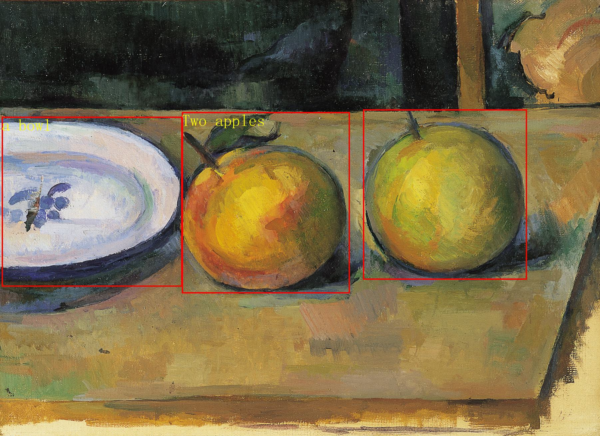

# Qwen-VL-Chat Tutorial
Qwen-VL-Chat is a generalist multimodal large-scale language model, and it can perform a wide range of vision-language tasks. In this tutorial, we will give some concise examples to demonstrate the capabilities of Qwen-VL-Chat in **Visual Question Answering, Text Understanding, Mathematical Reasoning with Diagrams, Multi-Figure Reasoning, and Grounding**. Please note that the examples shown are far from the limit of Qwen-VL-Chat's capabilities, **you can further explore Qwen-VL-Chat's capabilities by changing the input images and prompts!**

## Initializing the Qwen-VL-Chat model
Before you can use Qwen-VL-Chat, you first need to initialize Qwen-VL-Chat's tokenizer and Qwen-VL-Chat's model:

```python
import torch
from transformers import AutoModelForCausalLM, AutoTokenizer
from transformers.generation import GenerationConfig

# If you expect the results to be reproducible, set a random seed.
# torch.manual_seed(1234)

tokenizer = AutoTokenizer.from_pretrained("Qwen/Qwen-VL-Chat", trust_remote_code=True)

model = AutoModelForCausalLM.from_pretrained("Qwen/Qwen-VL-Chat", device_map="cuda", trust_remote_code=True).eval()
model.generation_config = GenerationConfig.from_pretrained("Qwen/Qwen-VL-Chat", trust_remote_code=True)
```
After executing the above code, ```tokenizer``` will correspond to the classifier used by Qwen-VL-Chat, while ```model``` will correspond to the model of Qwen-VL-Chat. The ```tokenizer``` is used for preprocessing the interleaved multimodal inputs, while the ```model``` is the Qwen-VL-Chat model itself.

## Using Qwen-VL-Chat
### **Multi-round visual question answering**
#### **The first question**
Let's get started with a simple example. As shown below, the file ```assets/mm_tutorial/Rebecca_(1939_poster).jpeg``` is a poster for the 1940 film Rebecca.

_Small.jpeg)

Let's ask what is the name of the film on the Qwen-VL-Chat poster. First of all, we use ```tokenizer.from_list_format``` which can preprocess and tokenize the input:
```python
query = tokenizer.from_list_format([
    {'image': 'assets/mm_tutorial/Rebecca_(1939_poster).jpeg'},
    {'text': 'What is the name of the movie in the poster?'},
])
```
Next, we can use ```model.chat``` to ask questions to the Qwen-VL-Chat model and get its response. Note that for the first question, the dialogue history is empty, so we use ```history=None```.
```python
response, history = model.chat(tokenizer, query=query, history=None)
print(response)
```
You are expected to get an output similar to the following:

> The name of the movie in the poster is "Rebecca."

This shows that the model correctly answered the given question! According to the poster, the title of the film is 
 indeed **Rebecca**.

#### **Multi-round question answering**
We can also continue to ask the model other questions, such as who is the director of the film. The dialogue history is not empty for subsequent questions, therefore we use ```history=history``` to pass the history of previous conversations to ``model.chat``:

```python
query = tokenizer.from_list_format([
    {'text': 'Who directed this movie?'},
])
response, history = model.chat(tokenizer, query=query, history=history)
print(response)
```

You are expected to get an output similar to the following:

> The movie "Rebecca" was directed by Alfred Hitchcock.

Again, the model answered the given question correctly! According to the poster, the director of the film is Alfred Hitchcock。

### **Text Understanding**
Qwen-VL-Chat also has the ability to understand images containing dense text. As shown below, the file ```assets/mm_tutorial/Hospital.jpeg``` is a hospital signage containing dense text.


We can ask questions about the location of different departments in the Hospital. Since the dialogue history is empty, so we use ```history=None```.
```python
query = tokenizer.from_list_format([
    {'image': 'assets/mm_tutorial/Hospital.jpg'},
    {'text': 'Based on the photo, which floor is the Department of Otorhinolaryngology on?'},
])
response, history = model.chat(tokenizer, query=query, history=None)
print(response)
```

You are expected to get an output similar to the following:

> The Department of Otorhinolaryngology is located on the 4th floor.

You can also ask further questions. In this case you need to use ```history=history``` to pass a history of previous conversations to ```model.chat```. 

```python
query = tokenizer.from_list_format([
    {'text': 'Based on the photo, which floor is the Department of Surgery on?'},
])
response, history = model.chat(tokenizer, query=query, history=history)
print(response)
```

You are expected to get an output similar to the following:

> The Department of Surgery is located on the 3rd floor.

### **Mathematical Reasoning with Diagram**
Using the model's diagram comprehension and mathematical reasoning capabilities, Qwen-VL-Chat can also perform some more complex tasks! As shown below, the file ```assets/mm_tutorial/Menu.jpeg``` is the menu of a restaurant. Now we want to know how much it would cost to purchase two Salmon Burgers and three Meat Lover's Pizzas.


```python
query = tokenizer.from_list_format([
    {'image': 'assets/mm_tutorial/Menu.jpeg'},
    {'text': 'How much would I pay if I want to order two Salmon Burger and three Meat Lover\'s Pizza? Think carefully step by step.'},
])
response, history = model.chat(tokenizer, query=query, history=None)
print(response)
```

```Think carefully step by step.``` is a common prompt that guides the model through complex tasks step by step. So if you have a complex task to complete, try using it to improve the accuracy of the model. You are expected to get an output similar to the following:

> To order two Salmon Burgers and three Meat Lover's Pizzas, you would need to pay the following:
> 
> 1. For two Salmon Burgers: x2 Salmon Burgers at $10 each = $20
> 2. For three Meat Lover's Pizzas: x3 Meat Lover's Pizzas at $12 each = $36
> 
> Therefore, the total cost would be $56.

### **Multi-Figure Reasoning and Chinese Input**
In the previous examples, we have demonstrated Qwen-VL-Chat's question-answering capability for a single image and English questions. However, Qwen-VL-Chat is actually a multilingual model that supports Chinese input and multiple images! In the following example, we let Qwen-VL-Chat compare the photos of two cities (Chongqing and Beijing) for us (```assets/mm_tutorial/Chongqing.jpeg``` and ```assets/mm_tutorial/Beijing.jpeg```) in Chinese:


```python
query = tokenizer.from_list_format([
    {'image': 'assets/mm_tutorial/Chongqing.jpeg'},
    {'image': 'assets/mm_tutorial/Beijing.jpeg'},
    {'text': '上面两张图片分别是哪两个城市？请对它们进行对比。'},
])
torch.manual_seed(5678)
response, history = model.chat(tokenizer, query=query, history=None)
print(response)
```

You are expected to get an output similar to the following:

> 第一张图片是重庆的城市天际线，它反映了现代都市的繁华与喧嚣。第二张图片是北京的天际线，它象征着中国首都的现代化和国际化。两座城市都是中国的重要城市，拥有独特的文化和发展历史。

**Please note that comparing cities is a fairly subjective question, so the responses generated by the model may be subject to a high degree of randomness. If you do not set the random seed using ```torch.manual_seed(5678)```, the output will be different each time. Even if you set the random seed, the results obtained may still differ from this tutorial due to differences in hardware and software environments.**

### **Grounding Capability**
In the last section of the tutorial, we demonstrate the ability of the Qwen-VL-Chat model to produce a bounding box. Qwen-VL-Chat can frame a specified area of an image with a rectangular box according to your language description. This may be a bit abstract, so let's look at the following example. As shown below, the file ```assets/mm_tutorial/Shanghai.jpg``` is a photo of Shanghai, and we'll start by asking the model to describe the image with a regular prompt.


```python
torch.manual_seed(1234)
query = tokenizer.from_list_format([
    {'image': 'assets/mm_tutorial/Shanghai.jpg'},
    {'text': '图里有啥'},
])
response, history = model.chat(tokenizer, query=query, history=None)
print(response)
```

You are expected to get an output similar to the following:

> 图中是中国上海的天际线，包括了上海塔、金茂大厦、上海环球金融中心、海洋大厦等著名建筑。

Next, let's talk to the model by using the prompt ```请给我框出图中上海环球金融中心和东方明珠``` and see what happens. Note that at this point you need to pass the history of previous conversations to ```model.chat``` using ```history=history```.

```python
query = tokenizer.from_list_format([
    {'text': '请给我框出图中上海环球金融中心和东方明珠'},
])
response, history = model.chat(tokenizer, query=query, history=history)
print(response)
```
You are expected to get an output similar to the following:
```xml
<ref>上海环球金融中心</ref><box>(667,437),(760,874)</box>和<ref>东方明珠</ref><box>(506,75),(582,946)</box>
```
The Qwen-VL-Chat model doesn't have a hand, but it doesn't reject your request either. Instead, it outputs something "strange" - In fact, the output of the model gives the location of the 上海环球金融中心（Shanghai World Financial Centre） and the 东方明珠（Oriental Pearl Tower） in markup language. You can visualise it using the following code:
```python
image = tokenizer.draw_bbox_on_latest_picture(response, history)
image.save('Shanghai_Output.jpg')
```
The saved ```Shanghai_Output.jpg``` will look similar to the screenshot below: 


After that, you can still chat with Qwen-VL-Chat as before:
```python
query = tokenizer.from_list_format([
    {'text': '帮我写个这座城市的旅游计划'},
])
response, history = model.chat(tokenizer, query=query, history=history)
print(response)
```

You are expected to get an output similar to the following:

> 好的，以下是一个简单的上海旅游计划：
>
> 第一天：
> 上午：抵达上海，前往酒店办理入住手续。
> 中午：享用午餐后，前往外滩，欣赏黄浦江畔的美景，游览上海地标性建筑如浦发银行大楼、汇丰银行大楼等。
> 下午：游览南京路步行街，购买特色礼品或品尝当地美食。
> 晚上：在南京路附近的餐厅享用晚餐，然后去看上海的夜景。
>
> 第二天：
> 上午：前往上海科技馆，了解科技发展历史，观看各种科技展览。
> 中午：在科技馆附近的餐厅享用午餐。
> 下午：游览世纪公园，欣赏美景并放松身心。
> 晚上：在南京路或附近的陆家嘴地区享用晚餐，然后去看上海的夜景。
>
> 第三天：
> 上午：游览上海迪士尼乐园或上海海昌海洋公园，与各种迪士尼角色互动，或者在海洋公园观看海洋生物表演。
> 中午：在迪士尼乐园或海洋公园附近的餐厅享用午餐。
> 下午：自由活动，可以去购物、品尝当地美食或者去博物馆等。
> 晚上：在酒店附近享用晚餐，然后离开上海。
>
> 当然，以上只是一个简单的计划，上海有许多其他景点和活动，例如参观上海博物馆、游览田子坊、观看上海话剧等。具体计划可以根据个人兴趣和时间进行调整。


**Please note that travel planning is a fairly subjective question, so the responses generated by the model may be subject to a high degree of randomness. If you do not set the random seed using ```torch.manual_seed(1234)```, the output will be different each time. Even if you set the random seed, the results obtained may still differ from this tutorial due to differences in hardware and software environments.**

### Grounded Captioning
Qwen-VL can output the bounding box information of the subject while captioning the image. For example:

```
img_url = 'assets/apple.jpeg'
query = tokenizer.from_list_format([
    {'image': img_url},
    {'text': 'Generate the caption in English with grounding:'},
])
response, history = model.chat(tokenizer, query=query, history=None)
print(response)

image = tokenizer.draw_bbox_on_latest_picture(response, history)
if image is not None:
    image.save('apple.jpg')
```

The saved ```apple.jpg``` will look similar to the screenshot below: 
<p align="left">
    
<p>

#### How to get the caption without any box-like annotations
Sometimes you may expect no box-like annotations in the response. In the case, you can stably get the cleaned text by the following post-processing.

```
# response = '<ref> Two apples</ref><box>(302,257),(582,671)</box><box>(603,252),(878,642)</box> and<ref> a bowl</ref><box>(2,269),(304,674)</box>'
import re
clean_response = re.sub(r'<ref>(.*?)</ref>(?:<box>.*?</box>)*(?:<quad>.*?</quad>)*', r'\1', response).strip()
print(clean_response)
# clean_response = 'Two apples and a bowl'
```
