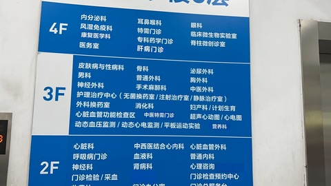
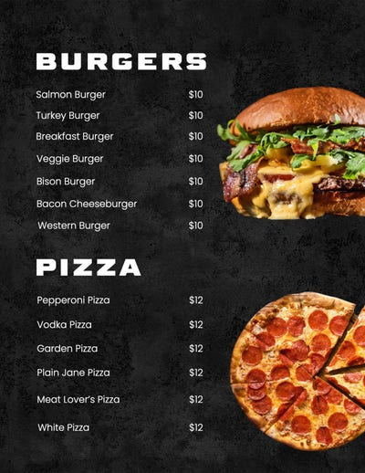
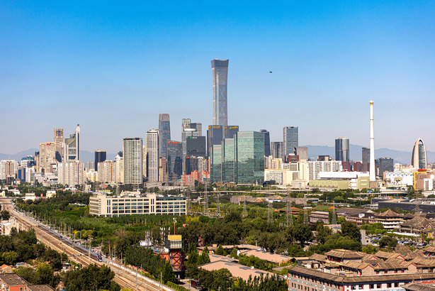
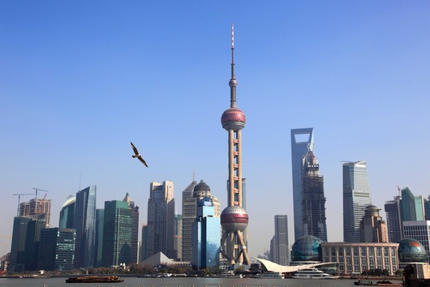
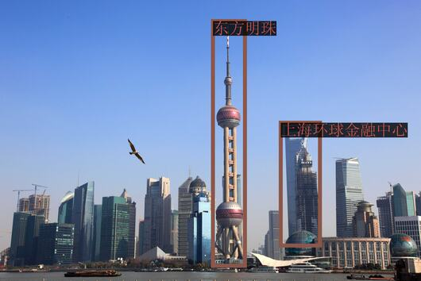

# Qwen-VL-Chat チュートリアル
Qwen-VL-Chat は汎用のマルチモーダル大規模言語モデルであり、幅広い視覚言語タスクを実行できます。このチュートリアルでは、Qwen-VL-Chat の**視覚的質問応答、テキスト理解、図を用いた数学的推論、多視点推論、およびグラウンディング**の機能について、いくつかの簡潔な例を挙げて説明します。Qwen-VL-Chat は、入力画像やプロンプトを変更することで、Qwen-VL-Chat の能力をさらに引き出すことができます。

## Qwen-VL-Chat モデルの初期化
Qwen-VL-Chat を使用する前に、まず Qwen-VL-Chat のトークナイザと Qwen-VL-Chat のモデルを初期化する必要があります:

```python
import torch
from transformers import AutoModelForCausalLM, AutoTokenizer
from transformers.generation import GenerationConfig

# 結果の再現性を期待する場合は、ランダムシードを設定する。
# torch.manual_seed(1234)

tokenizer = AutoTokenizer.from_pretrained("Qwen/Qwen-VL-Chat", trust_remote_code=True)

model = AutoModelForCausalLM.from_pretrained("Qwen/Qwen-VL-Chat", device_map="cuda", trust_remote_code=True).eval()
model.generation_config = GenerationConfig.from_pretrained("Qwen/Qwen-VL-Chat", trust_remote_code=True)
```
上記のコードを実行すると、```tokenizer``` は Qwen-VL-Chat で使用される分類器に対応し、```model``` は Qwen-VL-Chat のモデルに対応します。```tokenizer``` はインターリーブされたマルチモーダル入力の前処理に使用され、```model``` は Qwen-VL-Chat のモデルそのものです。

## Qwen-VL-Chat を使う
### **複数ラウンドのビジュアル質問回答**
#### **最初の質問**
簡単な例から始めましょう。以下に示すように、```assets/mm_tutorial/Rebecca_(1939_poster).jpeg``` は 1940 年の映画 レベッカのポスターです。

_Small.jpeg)

Qwen-VL-Chat のポスターに描かれている映画の名前を聞いてみよう。まず初めに、入力を前処理してトークン化する ```tokenizer.from_list_format``` を使用します:
```python
query = tokenizer.from_list_format([
    {'image': 'assets/mm_tutorial/Rebecca_(1939_poster).jpeg'},
    {'text': 'What is the name of the movie in the poster?'},
])
```
次に、```model.chat``` を使って Qwen-VL-Chat モデルに質問をし、その回答を得ることができます。最初の質問では、ダイアログの履歴は空なので、```history=None``` を使用することに注意してください。
```python
response, history = model.chat(tokenizer, query=query, history=None)
print(response)
```
以下のような出力が期待されます:

> The name of the movie in the poster is "Rebecca."

これは、モデルが与えられた問題に正しく答えたことを示しています！ポスターをみると、映画のタイトルは確かに**レベッカ**です。

#### **複数ラウンドの質問回答**
また、映画の監督は誰かなど、他の質問をモデルに続けることもできます。そのため、```history=history``` を使って、以前の会話の履歴を ``model.chat`` に渡します:

```python
query = tokenizer.from_list_format([
    {'text': 'Who directed this movie?'},
])
response, history = model.chat(tokenizer, query=query, history=history)
print(response)
```

以下のような出力が期待されます:

> The movie "Rebecca" was directed by Alfred Hitchcock.

再びこのモデルは与えられた問題に正解しました！ポスターによると、この映画の監督はアルフレッド・ヒッチコックです。

### **テキスト理解**
Qwen-VL-Chat には、高密度なテキストを含む画像を理解する機能もあります。下図に示すように、```assets/mm_tutorial/Hospital.jpeg``` というファイルは、濃いテキストを含む病院の看板です。



病院内のさまざまな診療科の場所について質問することができます。対話の履歴は空なので、```history=None``` を使用します。
```python
query = tokenizer.from_list_format([
    {'image': 'assets/mm_tutorial/Hospital.jpg'},
    {'text': 'Based on the photo, which floor is the Department of Otorhinolaryngology on?'},
])
response, history = model.chat(tokenizer, query=query, history=None)
print(response)
```

以下のような出力が期待されます:

> The Department of Otorhinolaryngology is located on the 4th floor.

さらに質問をすることもできます。この場合、```history=history``` を使用して、以前の会話の履歴を ```model.chat``` に渡す必要があります。

```python
query = tokenizer.from_list_format([
    {'text': 'Based on the photo, which floor is the Department of Surgery on?'},
])
response, history = model.chat(tokenizer, query=query, history=history)
print(response)
```

以下のような出力が期待されます:

> The Department of Surgery is located on the 3rd floor.

### **ダイアグラムによる数学的推論**
Qwen-VL-Chat は、このモデルのダイアグラム理解能力と数学的推論能力を使って、より複雑なタスクを実行することもできます！下に示すように、```assets/mm_tutorial/Menu.jpeg``` というファイルはレストランのメニューです。では、Salmon Burger 2 個と Meat Lover's Pizza 3 枚を購入した場合の値段を知りたい。



```python
query = tokenizer.from_list_format([
    {'image': 'assets/mm_tutorial/Menu.jpeg'},
    {'text': 'How much would I pay if I want to order two Salmon Burger and three Meat Lover\'s Pizza? Think carefully step by step.'},
])
response, history = model.chat(tokenizer, query=query, history=None)
print(response)
```

ステップバイステップで注意深く考えてください(```Think carefully step by step.```)」は、複雑なタスクを一歩ずつでモデルをガイドする一般的なプロンプトです。複雑なタスクをこなさなければならない場合、このプロンプトを使ってモデルの精度を上げてみてください。以下のような出力が期待されます:

> To order two Salmon Burgers and three Meat Lover's Pizzas, you would need to pay the following:
>
> 1. For two Salmon Burgers: x2 Salmon Burgers at $10 each = $20
> 2. For three Meat Lover's Pizzas: x3 Meat Lover's Pizzas at $12 each = $36
>
> Therefore, the total cost would be $56.

### **多視点推論と中国語入力**
これまでの例では、Qwen-VL-Chat が 1 つの画像と英語の質問に対して質問応答ができることを示しました。しかし、実際には Qwen-VL-Chat は中国語入力と複数の画像をサポートする多言語モデルです！以下の例では、Qwen-VL-Chat に 2 つの都市（重慶と北京）の写真（```assets/mm_tutorial/Chongqing.jpeg``` と ```assets/mm_tutorial/Beijing.jpeg```）を中国語で比較させています:




```python
query = tokenizer.from_list_format([
    {'image': 'assets/mm_tutorial/Chongqing.jpeg'},
    {'image': 'assets/mm_tutorial/Beijing.jpeg'},
    {'text': '上面两张图片分别是哪两个城市？请对它们进行对比。'},
])
torch.manual_seed(5678)
response, history = model.chat(tokenizer, query=query, history=None)
print(response)
```

以下のような出力が期待されます:

> 第一张图片是重庆的城市天际线，它反映了现代都市的繁华与喧嚣。第二张图片是北京的天际线，它象征着中国首都的现代化和国际化。两座城市都是中国的重要城市，拥有独特的文化和发展历史。

**都市の比較はかなり主観的な質問であるため、モデルによって生成される回答は高度なランダム性を持つ可能性があることに注意してください。```torch.manual_seed(5678)``` を使用してランダムシードを設定しない場合、出力は毎回異なります。ランダムシードを設定した場合でも、ハードウェアやソフトウェアの環境の違いにより、得られる結果がこのチュートリアルと異なる場合があります。**

### **グラウンディング能力**
チュートリアルの最後のセクションでは、Qwen-VL-Chat モデルがバウンディングボックスを生成する機能を紹介します。Qwen-VL-Chat は、言語記述に従って、画像の指定された領域を矩形の枠で囲むことができます。少し抽象的なので、次の例を見てみましょう。下図のように、ファイル ```assets/mm_tutorial/Shanghai.jpg``` は上海の写真です。まず、通常のプロンプトでモデルに画像を記述してもらいます。



```python
torch.manual_seed(1234)
query = tokenizer.from_list_format([
    {'image': 'assets/mm_tutorial/Shanghai.jpg'},
    {'text': '图里有啥'},
])
response, history = model.chat(tokenizer, query=query, history=None)
print(response)
```

以下のような出力が期待されます:

> 图中是中国上海的天际线，包括了上海塔、金茂大厦、上海环球金融中心、海洋大厦等著名建筑。

次に、プロンプト ```请给我框出图中上海环球金融中心和东方明珠``` を使ってモデルと会話してみましょう。このとき、```history=history``` を使って、以前の会話の履歴を ```model.chat``` に渡す必要があることに注意してください。

```python
query = tokenizer.from_list_format([
    {'text': '请给我框出图中上海环球金融中心和东方明珠'},
])
response, history = model.chat(tokenizer, query=query, history=history)
print(response)
```
以下のような出力が期待されます:
```xml
<ref>上海环球金融中心</ref><box>(667,437),(760,874)</box>和<ref>东方明珠</ref><box>(506,75),(582,946)</box>
```
Qwen-VL-Chat モデルには手はありませんが、だからといってリクエストを拒否することもありません。その代わりに、"奇妙な"ものが出力されます - 実際、モデルの出力は上海环球金融中心（上海ワールド・フィナンシャル・センター）と东方明珠（東方テレビタワー）の位置をマークアップ言語で示しています。次のコードで視覚化できます:
```python
image = tokenizer.draw_bbox_on_latest_picture(response, history)
image.save('Shanghai_Output.jpg')
```
保存された ```Shanghai_Output.jpg``` は以下のスクリーンショットのようになります:



その後、Qwen-VL-Chat で以前と同じようにチャットすることができます:
```python
query = tokenizer.from_list_format([
    {'text': '帮我写个这座城市的旅游计划'},
])
response, history = model.chat(tokenizer, query=query, history=history)
print(response)
```

以下のような出力が期待されます:

> 好的，以下是一个简单的上海旅游计划：
>
> 第一天：
> 上午：抵达上海，前往酒店办理入住手续。
> 中午：享用午餐后，前往外滩，欣赏黄浦江畔的美景，游览上海地标性建筑如浦发银行大楼、汇丰银行大楼等。
> 下午：游览南京路步行街，购买特色礼品或品尝当地美食。
> 晚上：在南京路附近的餐厅享用晚餐，然后去看上海的夜景。
>
> 第二天：
> 上午：前往上海科技馆，了解科技发展历史，观看各种科技展览。
> 中午：在科技馆附近的餐厅享用午餐。
> 下午：游览世纪公园，欣赏美景并放松身心。
> 晚上：在南京路或附近的陆家嘴地区享用晚餐，然后去看上海的夜景。
>
> 第三天：
> 上午：游览上海迪士尼乐园或上海海昌海洋公园，与各种迪士尼角色互动，或者在海洋公园观看海洋生物表演。
> 中午：在迪士尼乐园或海洋公园附近的餐厅享用午餐。
> 下午：自由活动，可以去购物、品尝当地美食或者去博物馆等。
> 晚上：在酒店附近享用晚餐，然后离开上海。
>
> 当然，以上只是一个简单的计划，上海有许多其他景点和活动，例如参观上海博物馆、游览田子坊、观看上海话剧等。具体计划可以根据个人兴趣和时间进行调整。


**旅行計画はかなり主観的な質問であるため、モデルによって生成される回答は高いランダム性を持つ可能性があることに注意してください。```torch.manual_seed(1234)``` を使用してランダムシードを設定しない場合、出力は毎回異なります。ランダムシードを設定した場合でも、ハードウェアやソフトウェアの環境の違いにより、得られる結果がこのチュートリアルと異なる場合があります。**
