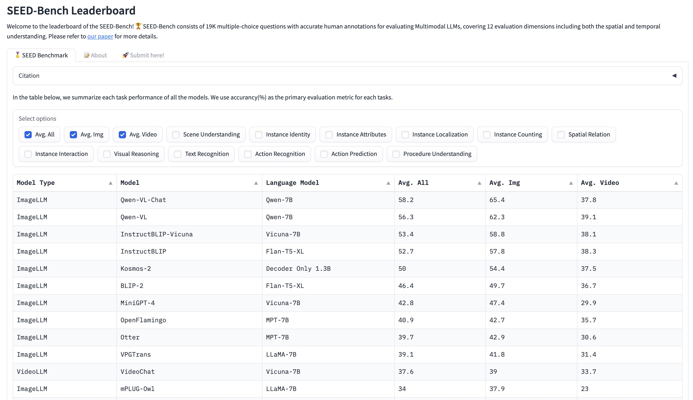

# Seed-Bench Evaluation

[SEED-Bench](https://huggingface.co/spaces/AILab-CVC/SEED-Bench_Leaderboard) is a multimodal benchmark of 19K multiple-choice questions with accurate human annotations for evaluating Multimodal LLMs, covering 12 evaluation dimensions including both **image** and **video** understanding.

Qwen-VL and Qwen-VL-Chat achieve SOTAs on this benchmark.

<p align="center">
    
<p>

## How To Process Video by Qwen-VL

Qwen-VL and Qwen-VL-Chat didn't train any video data or tasks during training, but they can understand some videos in a zero-shot way. For the video question-answering task, we utilize four uniformly sampled frames per video sample. These frames are treated as separate images and are stitched into the context. For example:

```
{
  "question_id": "v0",
  "prompt": "video_imgs_4/v0_0.jpg</img>\nvideo_imgs_4/v0_1.jpg</img>\nvideo_imgs_4/v0_2.jpg</img>\nvideo_imgs_4/v0_3.jpg</img>\nQuestion: Can you identify the action taking place in the video?\nOptions: A. pretending to take something out of something\nB. pretending to take something from somewhere\nC. feigning to insert something into something\nD. simulating putting something onto something\nAnswer:"
}
```

The above JSON line can be used as the input by `eval_mm/seed_bench/eval.py` and output the following results:
```
{"question_id": "v0", "prediction": "B"}
```

Please see [eval_mm/seed_bench/eval.py](eval.py) for more inference details.

## How To Reproduce Results of Seed-Bench

1. Download all images and videos by following the [instruction](https://github.com/AILab-CVC/SEED-Bench/blob/main/DATASET.md). Then modify the root path in `eval_mm/seed_bench/trans.py` with your customized path.
```
# path of SEED-Bench.json, download from https://huggingface.co/datasets/AILab-CVC/SEED-Bench/blob/main/SEED-Bench.json
seed_bench_input_path = 'SEED-Bench.json'
# root directory of evaluation dimension 1-9, following https://github.com/AILab-CVC/SEED-Bench/blob/main/DATASET.md
cc3m_dir = "/YOUR_PATH_TO/seed_bench_image"
# root directory of evaluation dimension 10
dimension10_dir = "/YOUR_PATH_TO/SSV2/videos"
# root directory of evaluation dimension 11
dimension11_dir = "/YOUR_PATH_TO/EPIC-KITCHENS/3h91syskeag572hl6tvuovwv4d/videos/test"
# root directory of evaluation dimension 12
dimension12_dir = "/YOUR_PATH_TO/BreakfastII_15fps_qvga_sync"
```

2. Generate input files of Qwen-VL with the JSON formatting.
```
cd eval_mm/seed_bench/
python trans.py
```
This script will output two JSONL files and one directory. `image_input.jsonl` is the input file of image evaluation and `video_input_4.jsonl` is the input file of video evaluation by 4 frames. The directory `video_imgs_4` contains all 4-framed images extracted from videos. We provide our [image_input.jsonl](http://ofasys-wlcb.oss-cn-wulanchabu.aliyuncs.com/Qwen-VL/evaluation/seed_bench/image_input.jsonl) and [video_input_4.jsonl](http://ofasys-wlcb.oss-cn-wulanchabu.aliyuncs.com/Qwen-VL/evaluation/seed_bench/video_input_4.jsonl) here for reference.

3. Produce the results of Seed-Bench.
```
# The number of available GPUs 
export NPROC_PER_NODE=8

# Produce the Qwen-VL-Chat results of image understanding
python -m torch.distributed.launch --use-env \
    --nproc_per_node ${NPROC_PER_NODE:-8} \
    --nnodes ${WORLD_SIZE:-1} \
    --node_rank ${RANK:-0} \
    --master_addr ${MASTER_ADDR:-127.0.0.1} \
    --master_port ${MASTER_PORT:-12345} \
    eval.py \
    --checkpoint Qwen/Qwen-VL-Chat \
    --dataset image_input.jsonl \
    --batch-size 4 \
    --num-workers 2
# Collect the result files
cat result_?.jsonl >results_chat_img.jsonl
rm result_?.jsonl

# Produce the results of video understanding
python -m torch.distributed.launch --use-env \
    --nproc_per_node ${NPROC_PER_NODE:-8} \
    --nnodes ${WORLD_SIZE:-1} \
    --node_rank ${RANK:-0} \
    --master_addr ${MASTER_ADDR:-127.0.0.1} \
    --master_port ${MASTER_PORT:-12345} \
    eval.py \
    --checkpoint Qwen/Qwen-VL-Chat \
    --dataset video_input_4.jsonl \
    --batch-size 2 \
    --num-workers 1
# Collect the result files
cat result_?.jsonl >results_chat_vid.jsonl
rm result_?.jsonl

# The file `results_chat.jsonl` can be submitted to the leaderboard
cat results_chat_img.jsonl results_chat_vid.jsonl >results_chat.jsonl
```

You can reproduce the Seed-Bench results of Qwen-VL by replacing `Qwen/Qwen-VL-Chat` with `Qwen/Qwen-VL` on the above script.
