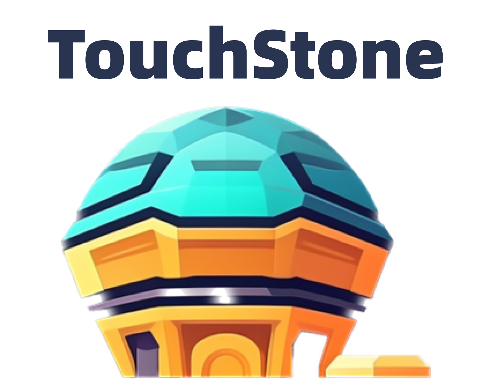
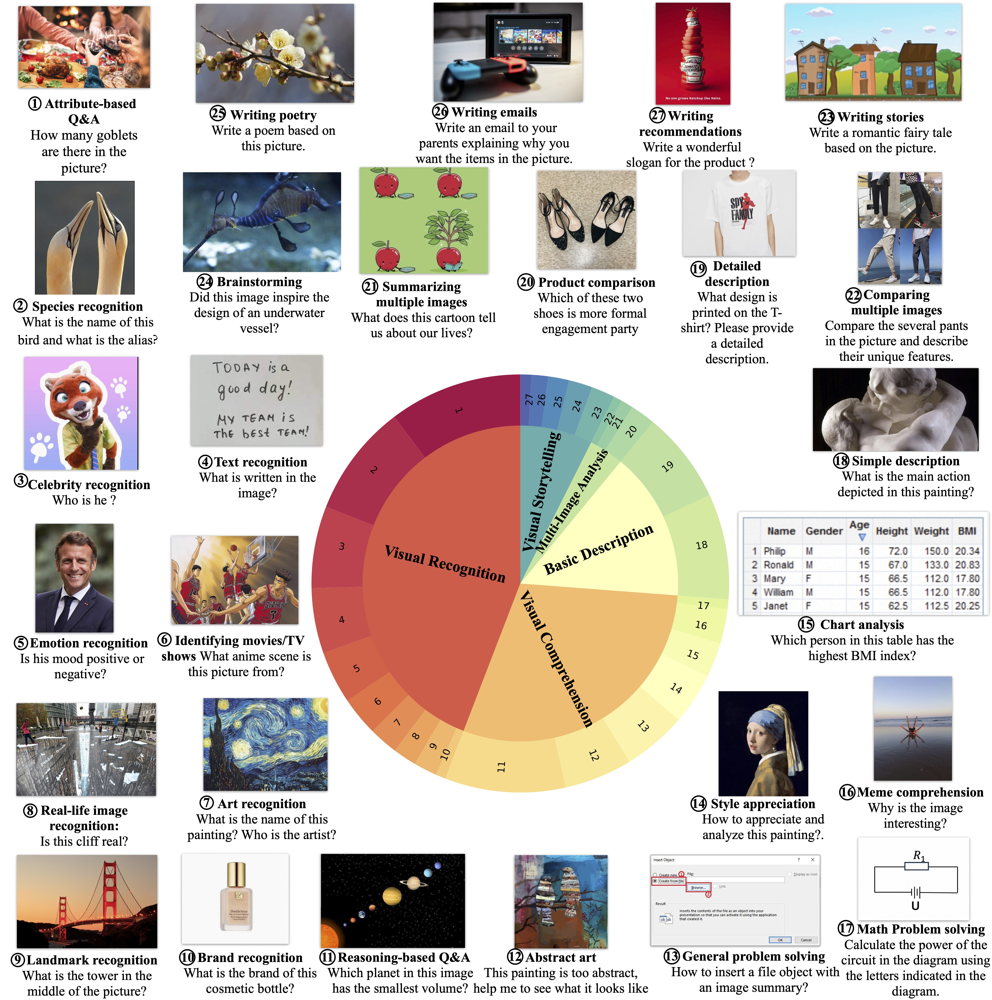
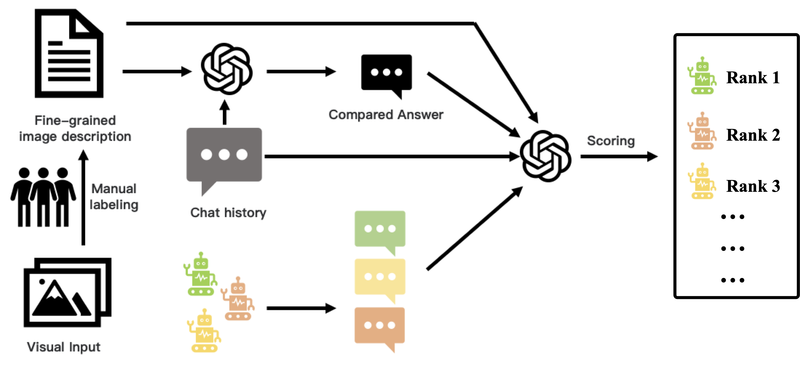

 

    

 

        <a href="../touchstone/README_CN.md">中文</a>&nbsp ｜ &nbspEnglish ｜ &nbsp<a href="../touchstone/README_JA.md">日本語</a> ｜ &nbsp<a href="../touchstone/README_KO.md">한국어</a> 

  

**터치스톤, TOUCHSTONE**은 기본적인 인식과 이해력뿐만 아니라 문학 창작까지 아우르는 종합적인 멀티모달 언어 모델 평가입니다. 평가 프로세스를 자동화하고 멀티모달 정보를 텍스트로 변환하는 터치스톤은 수동 개입 없이도 고급 언어 모델의 성능을 활용하여 대화 품질을 효율적이고 정확하게 평가할 수 있도록 지원합니다.

## DATASET

머신러닝의 능력을 평가하기 위해 기본 설명 능력, 시각 인식 능력, 시각 이해 능력, 시각 스토리텔링 능력, 다중 이미지 분석 능력 등 5가지 주요 모달을 포괄하는 다양하고 광범위한 데이터 세트를 구축합니다.

- **기본 설명 능력, Basic Descriptive Ability** 이미지 설명에는 단순 설명과 상세 설명을 포함하여 이미지에 포함된 정보를 설명하는 모델의 능력이 포함됩니다. 단순 설명은 일반적으로 이미지의 주요 주제와 동작을 설명하는 짧은 문구로 상세 설명은 이미지 장면, 속성 및 관계에 대한 보다 심층적인 정보를 제공합니다.

- **시각적 인식 능력, Visual Recognition Ability** 이미지 인식은 이미지 내의 사물이나 장면을 인식하고 관련 정보를 추론하는 작업입니다. 이 영역은 속성 QA, 영화/TV 인식, 예술 인식, 랜드마크 인식, 유명인 인식, 감정 인식, 텍스트 인식, 사물 인식, 구조물 내용 인식 등 여러 하위 작업으로 세분화할 수 있습니다. 

- **시각적 이해 능력, Visual Comprehension Ability** 이미지 이해에는 이미지의 의미와 관련 작업을 이해하는 모델의 능력이 포함됩니다. 이 영역에는 스타일 감상, 추상적 이미지 이해, 밈 이해, 이미지 분석, 차트 분석, 일반적인 문제 해결, 추론 QA와 같은 여러 하위 작업이 포함됩니다.

- **시각적 스토리텔링 능력, Visual Storytelling Ability** 시각적 스토리텔링 능력은 이메일, 시, 스토리, 광고/상품 추천, 브레인스토밍 등 시각적 콘텐츠를 기반으로 문학적 창작을 하는 과정입니다. 

- **다중 이미지 분석 능력, Multi-Image Analysis Ability** 다중 이미지 분석은 여러 이미지를 분석하고 비교하는 작업입니다. 이 영역에는 두 개/여러 개의 이미지 비교, 여러 이미지 정보 요약, 상품 비교, 이미지의 단계별 분석 등의 작업이 포함됩니다.

    

5가지 측면에서 모델의 능력을 종합적으로 평가합니다. 위 그림과 같이 27개의 하위 과제를 예로 들었습니다. 지각부터 인지, 창의력까지 난이도가 높아질수록 모델에 대한 요구 사항도 점점 더 높아지고 있습니다. 현재 LVLM 기능은 초기 단계에 있습니다. 데이터 세트에는 800개 이상의 질문과 27개 카테고리가 포함되어 있습니다.

## Methods

당사는 자동화된 평가를 위해 강력한 LLM을 심사자로 적용합니다. 이미지의 내용을 효과적으로 이해하기 위해 실제 이미지 입력을 세분화된 텍스트 주석으로 수동으로 대체합니다. 이러한 주석과 해당 질문을 GPT4와 같은 강력한 LLM에 입력하면 참조 답변을 얻을 수 있습니다.

LVLM의 평가를 위해 실제 이미지와 질문을 입력으로 제공하고 각각의 답변을 얻습니다. 마지막으로, 세분화된 주석과 질문을 기반으로 LVLM이 생성한 답변에 GPT4를 사용하여 점수를 매깁니다. 채점 지침에 따라 모델은 주석을 이미지의 콘텐츠로 간주하여 답변의 유용성, 관련성 및 정확성을 평가해야 합니다. 평가의 공정성을 보장하기 위해 각 모델의 답변은 GPT4의 일관된 참조 답변과 비교됩니다. 모든 문제에서 모델의 평균 점수가 최종 점수로 사용됩니다.

답안 위치의 영향을 제거하기 위해 답안 위치를 바꿔서 두 번째 채점 라운드를 수행한 다음 얻은 두 점수의 평균을 계산합니다. 이 접근 방식은 답안 배치로 인해 발생하는 편향을 완화하는 것을 목표로 합니다.

    

### Evaluation

#### Evaluation in English-based Multimodal Dialogue

| Model         | Score |
|---------------|-------|
| PandaGPT      | 488.5 |
| MiniGPT4      | 531.7 |
| InstructBLIP  | 552.4 |
| LLaMA-AdapterV2 | 590.1 |
| mPLUG-Owl     | 605.4 |
| LLaVA         | 602.7 |
| Qwen-VL-Chat   | 645.2 |

#### Evaluation in Chinese-based Multimodal Dialogue

| Model         | Score |
|---------------|-------|
| VisualGLM     | 247.1 |
| Qwen-VL-Chat   | 401.2 |

